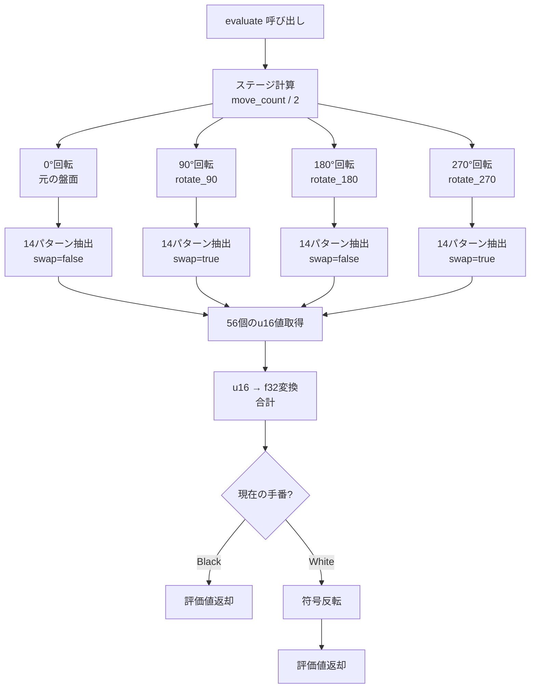

# 技術設計書: Phase 1 基礎実装

## Overview

**目的**: 本機能はオセロAIの**基礎層**を提供し、Phase 2（探索）およびPhase 3（学習）の実装基盤を確立する。

**ユーザー**: Phase 2/3の実装者、AI研究者、システムアーキテクトが、高速なBitBoard操作、パターン評価システム、型安全なゲームルールAPIを利用する。

**影響**: 既存システムなし（greenfield実装）。本フェーズ完了後、100万局の自己学習を支える性能基盤（合法手生成500ns、パターン抽出25μs、評価関数35μs）が確立される。

### Goals

- BitBoardによる高速盤面表現（u64ビット演算、16バイト/盤面）
- 14パターン × 30ステージ × 対称性活用による評価システム基盤
- パフォーマンス要件達成（要件15: 合法手500ns、パターン抽出25μs、評価35μs以内）
- ARM64（Ampere A1 Neoverse N1）アーキテクチャに最適化されたメモリレイアウト
- Structure of Arrays（SoA）形式による評価テーブルのキャッシュ効率化
- Rust型システムによる不正状態の防止（コンパイル時エラー検出）
- Phase 2への完全なAPI提供（盤面操作、評価関数、パターン管理）

### Non-Goals

- 探索アルゴリズム（MTD(f)、AlphaBeta）の実装 → Phase 2に委譲
- 学習機能（TD(λ)-Leaf、Adam）の実装 → Phase 3に委譲
- Python連携（PyO3）→ Phase 4に委譲
- GUI・可視化機能 → 将来の拡張
- ネットワーク対戦機能 → スコープ外

## Architecture

### Architecture Pattern & Boundary Map

**選定パターン**: **Layered Architecture with Data-Oriented Design**

**ドメイン境界**:
```
┌─────────────────────────────────────────────────────┐
│ Public API Layer (lib.rs)                           │
│  - BitBoard operations (new, make_move, legal_moves)│
│  - Evaluator (evaluate, load_patterns)              │
│  - Pattern management (load from CSV)               │
└──────────────┬──────────────────────────────────────┘
               │
┌──────────────▼──────────────────────────────────────┐
│ Core Domain Layer                                   │
│  ┌─────────────┐  ┌──────────────┐  ┌────────────┐ │
│  │ board.rs    │  │ pattern.rs   │  │evaluator.rs│ │
│  │ BitBoard    │  │ Pattern      │  │ Evaluator  │ │
│  │ Color       │  │ extract()    │  │ evaluate() │ │
│  └─────────────┘  └──────────────┘  └────────────┘ │
│  ┌─────────────┐  ┌──────────────┐  ┌────────────┐ │
│  │ moves.rs    │  │ rotation.rs  │  │ arm64.rs   │ │
│  │ legal_moves │  │ rotate_90    │  │ NEON opt   │ │
│  │ make_move   │  │ rotate_180   │  │ prefetch   │ │
│  └─────────────┘  └──────────────┘  └────────────┘ │
└──────────────┬──────────────────────────────────────┘
               │
┌──────────────▼──────────────────────────────────────┐
│ Data Layer                                          │
│  - Pattern definitions (Vec<Pattern>)               │
│  - Evaluation tables (SoA format: Vec<Box<[u16]>>)  │
│  - CSV loader (patterns.csv reader)                 │
└─────────────────────────────────────────────────────┘
```

**Architecture Integration**:
- **選定理由**: データ指向設計はRustの所有権モデルと親和性が高く、BitBoard（16バイト）の効率的なコピー・移動を実現
- **境界分離**: board.rs（ゲームルール）、pattern.rs（パターン抽出ロジック）、evaluator.rs（評価計算）、arm64.rs（ARM64専用最適化）を独立したモジュールに分離
- **SoA最適化**: 評価テーブルをStructure of Arrays形式で実装し、同じステージの全パターンを連続メモリ配置
- **新コンポーネント根拠**:
  - `BitBoard`: u64による盤面表現でビット演算の高速性を活用
  - `Pattern`: パターン定義の不変性をRust型システムで保証、固定長配列でヒープアロケーション回避
  - `Evaluator`: 14パターン × 30ステージの大規模テーブル管理、SoA形式でキャッシュヒット率向上
  - `arm64.rs`: ARM64専用最適化（NEON SIMD、REV/CLZ命令、プリフェッチ）を集約
- **Steering準拠**: データ指向設計、型安全性、パフォーマンス優先、ARM64最適化の原則に整合

### Technology Stack

| Layer | Choice / Version | Role in Feature | Notes |
|-------|------------------|-----------------|-------|
| Core Language | Rust 1.70+ | BitBoard実装、パターン抽出、評価関数 | ARM64対応、所有権による安全性、ゼロコスト抽象化 |
| Data Parsing | csv 1.3+, serde 1.0+ | patterns.csv読み込み | `#[derive(Deserialize)]`で自動パース、エラーハンドリング統合 |
| Error Handling | thiserror 1.0+ | カスタムエラー型定義 | `#[derive(Error)]`で簡潔なエラー型実装 |
| Benchmarking | criterion 0.5+ | パフォーマンス測定 | マイクロベンチマーク、統計分析、各主要タスク完了時に実施 |
| Testing | Rust標準test framework | ユニット・統合テスト | `#[test]`, `#[cfg(test)]` |

**根拠**:
- **Rust 1.70+**: ARM64（OCI Ampere A1）サポート、const generics安定化、所有権システムによるメモリ安全性
- **csv + serde**: BurntSushi/rust-csvは高速・信頼性高、serde統合で型安全なデシリアライズ
- **thiserror**: boilerplate削減、`std::error::Error`トレイト自動実装
- **criterion**: 統計的に信頼性の高いベンチマーク、段階的パフォーマンス検証

**ARM64最適化フラグ**:
```toml
[profile.release]
opt-level = 3
lto = "fat"
codegen-units = 1
panic = "abort"

# ARM64専用最適化
[target.aarch64-unknown-linux-gnu]
rustflags = ["-C", "target-cpu=neoverse-n1", "-C", "target-feature=+neon,+crc,+crypto"]
```

    Board->>Moves: is_legal(position)?
    Moves-->>Board: Result<bool, GameError>

    alt Legal move
        Board->>Flip: find_flipped_in_8_directions(position)
        Flip-->>Board: flipped_bits: u64
        Board->>Board: apply_flip(current_player |= flipped_bits)
        Board->>Board: opponent &= !flipped_bits
        Board->>Board: toggle_turn()
        Board-->>API: Ok(UndoInfo)
    else Illegal move
        Board-->>API: Err(GameError::IllegalMove)
    end
```

**Key Decisions**:
- `make_move`は`Result<UndoInfo, GameError>`を返し、非合法手はコンパイル時にハンドリング強制
- `UndoInfo`は元の盤面状態（black, white, turn）を保持し、Phase 2の探索でundo可能に
- 8方向の石返し処理は並列化不要（シーケンシャル処理で十分高速）

### パターン抽出フロー（4方向回転）



**Key Decisions**:
- **90°/270°回転時の白黒反転は群論的必然性**:
  - 正方形の対称性はDihedral Group D4（位数8の群）で記述される
  - 90°回転 = 主対角線に関する鏡映 ∘ 中心反転（群の合成演算）
  - この変換により黒石と白石の役割が数学的に入れ替わる
  - 0°/180°回転は中心対称であり、両色が同時に反転するため相対関係は保存される
  - したがって`swap=true`は設計上の選択ではなく数学的要請
- 各回転方向で14パターン抽出（合計56インスタンス）を並列化せず順次処理（メモリ局所性優先）
- u16→f32変換を抽出後に実施（整数演算の高速性を活用）

## Requirements Traceability

| Requirement | Summary | Components | Interfaces | Flows |
|-------------|---------|------------|------------|-------|
| 1.1, 1.2, 1.3, 1.4, 1.5 | BitBoard盤面表現（黒白u64、手番、初期化、反転） | BitBoard, Color | `BitBoard::new()`, `BitBoard::flip()` | - |
| 2.1, 2.2, 2.3, 2.4, 2.5 | 合法手生成（8方向、ビット演算、1μs以内） | LegalMovesGenerator | `legal_moves(&BitBoard) -> u64` | BitBoard操作フロー |
| 3.1, 3.2, 3.3, 3.4, 3.5 | 着手実行と石返し（8方向反転、undo、エラー処理） | MoveExecutor | `make_move(&mut BitBoard, u8) -> Result<UndoInfo, GameError>` | BitBoard操作フロー |
| 4.1, 4.2, 4.3, 4.4, 4.5 | ゲーム終了判定（パス、終了、スコア、手数） | GameStateManager | `is_game_over(&BitBoard) -> bool`, `final_score(&BitBoard) -> i8` | - |
| 5.1, 5.2, 5.3, 5.4, 5.5 | BitBoard回転（90°/180°/270°、対称性保証） | RotationOps | `rotate_90(u64) -> u64`, `rotate_180(u64) -> u64`, `rotate_270(u64) -> u64` | パターン抽出フロー |
| 6.1, 6.2, 6.3, 6.4, 6.5 | パターン定義読み込み（CSV、検証、グローバル保持） | PatternLoader | `load_patterns(path: &str) -> Result<Vec<Pattern>, CsvError>` | - |
| 7.1, 7.2, 7.3, 7.4, 7.5 | パターンインデックス抽出（3進数、白黒反転、決定性） | PatternIndexer | `extract_index(u64, u64, &Pattern, bool) -> usize` | パターン抽出フロー |
| 8.1, 8.2, 8.3, 8.4, 8.5 | 4方向パターン抽出（56インスタンス、回転+反転） | PatternExtractor | `extract_all_patterns(&BitBoard) -> [usize; 56]` | パターン抽出フロー |
| 9.1, 9.2, 9.3, 9.4, 9.5 | 評価テーブル管理（3次元配列、初期化32768、u16型） | EvaluationTable | `EvaluationTable::new() -> Self`, `get(&self, pattern, stage, index) -> u16` | - |
| 10.1, 10.2, 10.3, 10.4, 10.5 | スコア型変換（u16↔f32、範囲-128～+127.996） | ScoreConverter | `u16_to_score(u16) -> f32`, `score_to_u16(f32) -> u16` | パターン抽出フロー |
| 11.1, 11.2, 11.3, 11.4, 11.5 | 基本評価関数（56パターン合計、手番考慮、50μs以内） | Evaluator | `evaluate(&self, &BitBoard) -> f32` | パターン抽出フロー |
| 12.1, 12.2, 12.3, 12.4, 12.5 | ステージ管理（手数÷2、0-29範囲、評価テーブルアクセス） | StageCalculator | `calculate_stage(move_count: u8) -> usize` | パターン抽出フロー |
| 13.1, 13.2, 13.3, 13.4, 13.5 | メモリ効率と型安全性（16B/盤面、60MB以内、所有権、Result型） | 全コンポーネント | - | - |
| 14.1, 14.2, 14.3, 14.4, 14.5 | ユニットテストとデバッグ（初期盤面、合法手、対称性、表示関数） | TestSuite | `#[test] fn test_initial_board()`, `display(&BitBoard) -> String` | - |
| 15.1, 15.2, 15.3, 15.4, 15.5 | パフォーマンス要件（1μs合法手、10μsパターン抽出、50μs評価） | 全コンポーネント | - | 全フロー |

## Components and Interfaces

### Component Summary

| Component | Domain/Layer | Intent | Req Coverage | Key Dependencies (P0/P1) | Contracts |
|-----------|--------------|--------|--------------|--------------------------|-----------|
| BitBoard | Core/Board | 盤面状態管理（黒白u64、手番、手数） | 1.1, 1.2, 1.3, 1.4, 1.5 | なし (P0) | State |
| LegalMovesGenerator | Core/Moves | 合法手生成（8方向ビット演算） | 2.1, 2.2, 2.3, 2.4, 2.5 | BitBoard (P0) | Service |
| MoveExecutor | Core/Moves | 着手実行と石返し処理 | 3.1, 3.2, 3.3, 3.4, 3.5 | BitBoard (P0), LegalMovesGenerator (P0) | Service |
| GameStateManager | Core/Board | ゲーム終了判定・スコア計算 | 4.1, 4.2, 4.3, 4.4, 4.5 | BitBoard (P0) | Service |
| RotationOps | Core/Rotation | BitBoard回転操作（90°/180°/270°） | 5.1, 5.2, 5.3, 5.4, 5.5 | なし (P0) | Service |
| PatternLoader | Data/Pattern | patterns.csv読み込みとパース | 6.1, 6.2, 6.3, 6.4, 6.5 | csv crate (P0), serde (P0) | Service |
| PatternIndexer | Core/Pattern | 3進数インデックス計算 | 7.1, 7.2, 7.3, 7.4, 7.5 | BitBoard (P0), Pattern (P0) | Service |
| PatternExtractor | Core/Pattern | 4方向56パターン抽出 | 8.1, 8.2, 8.3, 8.4, 8.5 | RotationOps (P0), PatternIndexer (P0) | Service |
| EvaluationTable | Data/Evaluator | 14×30×3^k評価テーブル管理 | 9.1, 9.2, 9.3, 9.4, 9.5 | Pattern (P0) | State |
| ScoreConverter | Core/Evaluator | u16↔f32スコア変換 | 10.1, 10.2, 10.3, 10.4, 10.5 | なし (P0) | Service |
| Evaluator | Core/Evaluator | 盤面評価関数（56パターン合計） | 11.1, 11.2, 11.3, 11.4, 11.5 | PatternExtractor (P0), EvaluationTable (P0), ScoreConverter (P0) | Service |
| StageCalculator | Core/Evaluator | ステージ番号計算（手数÷2） | 12.1, 12.2, 12.3, 12.4, 12.5 | BitBoard (P0) | Service |

### Core Domain / Board

#### BitBoard

| Field | Detail |
|-------|--------|
| Intent | オセロ盤面の状態を表現し、基本的な盤面操作を提供 |
| Requirements | 1.1, 1.2, 1.3, 1.4, 1.5 |

**Responsibilities & Constraints**
- BitBoardは黒石・白石・手番の3つの情報を保持（計16バイト）
- 不変性の原則: 操作は新しいBitBoardを返すか、`&mut self`で明示的に変更
- 手数カウンタは初期0、着手ごとに+1、最大60

**Dependencies**
- Inbound: なし（最下層のドメインモデル）
- Outbound: なし
- External: なし

**Contracts**: State [x]

##### State Management

```rust
#[derive(Clone, Copy, Debug, PartialEq, Eq)]
pub struct BitBoard {
    black: u64,       // 黒石の配置ビットマスク
    white: u64,       // 白石の配置ビットマスク
    turn: Color,      // 現在の手番
    move_count: u8,   // 手数カウンタ（0-60）
}

#[derive(Clone, Copy, Debug, PartialEq, Eq)]
#[repr(u8)]
pub enum Color {
    Black = 0,
    White = 1,
}

impl Color {
    pub fn opposite(self) -> Color {
        match self {
            Color::Black => Color::White,
            Color::White => Color::Black,
        }
    }
}

impl BitBoard {
    /// 初期盤面を生成（D4白、E4黒、D5黒、E5白）
    pub fn new() -> Self {
        Self {
            black: (1 << 28) | (1 << 35),  // E4, D5
            white: (1 << 27) | (1 << 36),  // D4, E5
            turn: Color::Black,
            move_count: 0,
        }
    }

    /// 盤面を白黒反転（手番も反転）
    pub fn flip(&self) -> Self {
        Self {
            black: self.white,
            white: self.black,
            turn: self.turn.opposite(),
            move_count: self.move_count,
        }
    }

    /// 現在の手番のビットマスクを取得
    pub fn current_player(&self) -> u64 {
        match self.turn {
            Color::Black => self.black,
            Color::White => self.white,
        }
    }

    /// 相手の手番のビットマスクを取得
    pub fn opponent(&self) -> u64 {
        match self.turn {
            Color::Black => self.white,
            Color::White => self.black,
        }
    }
}
```

**Persistence & Consistency**:
- メモリ上のみ（Phase 1ではファイル永続化なし）
- `Clone, Copy`トレイトで軽量コピー可能
- `PartialEq, Eq`でテスト時の同値性比較

**Concurrency Strategy**:
- Phase 1では単一スレッド動作
- `Copy`トレイトにより複数所有可能（スレッド間共有不要）

**Implementation Notes**
- Integration: 座標→ビット位置マッピングは`A1=0, B1=1, ..., H8=63`（行優先）
- Validation: 黒白のビットが重複しないこと（`black & white == 0`）をdebug_assertで検証
- Risks: ビット演算の論理エラー（ユニットテストで全方向チェック）

#### GameStateManager

| Field | Detail |
|-------|--------|
| Intent | ゲームの終了判定、パス判定、最終スコア計算 |
| Requirements | 4.1, 4.2, 4.3, 4.4, 4.5 |

**Responsibilities & Constraints**
- 合法手の有無を判定し、パス・ゲーム終了を決定
- 最終スコアは黒石数 - 白石数（-64～+64の範囲）
- 手数60または両者パスで強制終了

**Dependencies**
- Inbound: Evaluator, MoveExecutor (P1)
- Outbound: BitBoard (P0), LegalMovesGenerator (P0)

**Contracts**: Service [x]

##### Service Interface

```rust
pub enum GameState {
    Playing,           // ゲーム継続中
    Pass,              // 現在の手番はパス（相手に手番移行）
    GameOver(i8),      // ゲーム終了（最終スコア: 正=黒勝ち、負=白勝ち）
}

/// ゲーム状態を判定
pub fn check_game_state(board: &BitBoard) -> GameState {
    // 手数60なら強制終了
    if board.move_count >= 60 {
        return GameState::GameOver(final_score(board));
    }

    // 盤面が満杯なら終了
    if (board.black | board.white).count_ones() == 64 {
        return GameState::GameOver(final_score(board));
    }

    // 現在の手番の合法手チェック
    let current_legal = legal_moves(board);
    if current_legal != 0 {
        return GameState::Playing;
    }

    // 相手の合法手チェック
    let flipped = board.flip();
    let opponent_legal = legal_moves(&flipped);

    if opponent_legal != 0 {
        GameState::Pass
    } else {
        GameState::GameOver(final_score(board))
    }
}

/// 最終スコア計算（黒石数 - 白石数）
pub fn final_score(board: &BitBoard) -> i8 {
    let black_count = board.black.count_ones() as i8;
    let white_count = board.white.count_ones() as i8;
    black_count - white_count
}
```

**Preconditions**: BitBoardが有効な状態（black & white == 0）
**Postconditions**: GameStateは常に整合性のある状態を返す
**Invariants**: 最終スコアは-64～+64の範囲内

**Implementation Notes**
- Integration: Phase 2の探索アルゴリズムから呼び出される
- Validation: 両者パス判定は盤面反転を1回のみ実施（効率化）
- Risks: パス判定の見落とし（ユニットテストで既知局面検証）

### Core Domain / Moves

#### LegalMovesGenerator

| Field | Detail |
|-------|--------|
| Intent | 現在の盤面状態から全合法手をビットマスクとして生成 |
| Requirements | 2.1, 2.2, 2.3, 2.4, 2.5 |

**Responsibilities & Constraints**
- 8方向それぞれについて挟める相手の石を検出
- 合法手なしの場合は`0x0000000000000000`を返す
- 実行時間1マイクロ秒以内（パフォーマンス要件）

**Dependencies**
- Inbound: MoveExecutor (P0), GameStateManager (P0)
- Outbound: BitBoard (P0)

**Contracts**: Service [x]

##### Service Interface

```rust
/// 合法手をビットマスクで返す
pub fn legal_moves(board: &BitBoard) -> u64 {
    let player = board.current_player();
    let opponent = board.opponent();
    let empty = !(player | opponent);

    let mut moves = 0u64;

    // 8方向それぞれについて処理
    for &dir in &DIRECTIONS {
        let mut candidates = shift(opponent, dir) & player;
        while candidates != 0 {
            candidates = shift(candidates, dir);
            moves |= candidates & empty;
            candidates &= opponent;
        }
    }

    moves
}

const DIRECTIONS: [i32; 8] = [
    -9, -8, -7,  // 左上、上、右上
    -1,      1,  // 左、右
     7,  8,  9,  // 左下、下、右下
];

/// ビットマスクを指定方向にシフト（端の処理含む）
fn shift(bits: u64, dir: i32) -> u64 {
    match dir {
        -9 => (bits >> 9) & 0x007F7F7F7F7F7F7F,  // 左上（右端マスク）
        -8 => bits >> 8,                          // 上
        -7 => (bits >> 7) & 0x00FEFEFEFEFEFEFE,  // 右上（左端マスク）
        -1 => (bits >> 1) & 0x7F7F7F7F7F7F7F7F,  // 左（右端マスク）
         1 => (bits << 1) & 0xFEFEFEFEFEFEFEFE,  // 右（左端マスク）
         7 => (bits << 7) & 0x7F7F7F7F7F7F7F00,  // 左下
         8 => bits << 8,                          // 下
         9 => (bits << 9) & 0xFEFEFEFEFEFEFE00,  // 右下
        _ => 0,
    }
}
```

**Preconditions**: BitBoardが有効な状態
**Postconditions**: 返されたビットマスクの全ビットは空マスかつ合法手
**Invariants**: `legal_moves(board) & (board.black | board.white) == 0`

**Implementation Notes**
- Integration: 探索・UI・ゲーム制御から頻繁に呼び出される
- Validation: 既知局面（初期盤面、中盤、終盤）での期待値テスト
- Risks: 端の処理ミス（マスクの誤り）→ 各方向のユニットテスト必須

#### MoveExecutor

| Field | Detail |
|-------|--------|
| Intent | 指定位置に石を置き、挟んだ石を返す処理を実行 |
| Requirements | 3.1, 3.2, 3.3, 3.4, 3.5 |

**Responsibilities & Constraints**
- 合法手のみ受け付け、非合法手は`GameError::IllegalMove`を返す
- 8方向の石返し処理を実施し、手番を相手に切り替え
- Undo情報（UndoInfo）を返却し、探索でのバックトラック可能に

**Dependencies**
- Inbound: Public API (P0), 探索アルゴリズム (P1 - Phase 2)
- Outbound: BitBoard (P0), LegalMovesGenerator (P0)

**Contracts**: Service [x]

##### Service Interface

```rust
pub struct UndoInfo {
    black: u64,
    white: u64,
    turn: Color,
    move_count: u8,
}

#[derive(Debug, thiserror::Error)]
pub enum GameError {
    #[error("Illegal move at position {0}")]
    IllegalMove(u8),
    #[error("Position out of bounds: {0}")]
    OutOfBounds(u8),
}

/// 着手を実行し、元の状態をUndoInfo として返す
pub fn make_move(board: &mut BitBoard, pos: u8) -> Result<UndoInfo, GameError> {
    // 範囲チェック
    if pos >= 64 {
        return Err(GameError::OutOfBounds(pos));
    }

    // 合法手チェック
    let legal = legal_moves(board);
    if legal & (1 << pos) == 0 {
        return Err(GameError::IllegalMove(pos));
    }

    // Undo情報保存
    let undo = UndoInfo {
        black: board.black,
        white: board.white,

## Key Data Structures

### BitBoard (board.rs)

```rust
#[repr(C, align(8))]
#[derive(Clone, Copy, Debug, PartialEq, Eq)]
pub struct BitBoard {
    pub black: u64,      // 黒石のビットマスク
    pub white: u64,      // 白石のビットマスク
    pub turn: Color,     // 現在の手番
    pub move_count: u8,  // 手数カウンタ (0-60)
}

#[derive(Clone, Copy, Debug, PartialEq, Eq)]
pub enum Color {
    Black = 0,
    White = 1,
}
```

**設計根拠**:
- `#[repr(C, align(8))]`: 8バイトアライメントでキャッシュライン効率化
- `Copy` trait: 16バイトのスタックコピーで所有権移動の煩雑さを回避
- `u8` move_count: 60手で十分、メモリ節約

### Pattern (pattern.rs)

**改善前（問題あり）**:
```rust
struct Pattern {
    id: String,           // 24バイト（ヒープ）
    k: usize,             // 8バイト
    positions: Vec<u8>,   // 24バイト（ヒープ）
}
```

**改善後（最適化版）**:
```rust
#[repr(C, align(8))]
pub struct Pattern {
    pub id: u8,               // 1バイト（P01 → 0）
    pub k: u8,                // 1バイト
    _padding: [u8; 6],        // パディング
    pub positions: [u8; 10],  // 10バイト（固定長）
}
```

**設計根拠**:
- ヒープアロケーション削減: String/Vecを固定長配列に変更
- キャッシュ効率向上: 24バイト（+ヒープ） → 24バイト（スタック）
- アライメント最適化: 8バイトアライメントでキャッシュライン整合

### EvaluationTable (evaluator.rs)

**改善前（問題あり）**:
```rust
struct EvaluationTable {
    // [pattern_id][stage][index] -> u16
    tables: Vec<Vec<Vec<u16>>>,  // ランダムアクセスでキャッシュミス多発
}

// アクセスパターン
for i in 0..56 {
    let pattern_id = i % 14;  // 0,1,2,...,13,0,1,2,... （飛び飛び）
    let score = table[pattern_id][stage][indices[i]];  // キャッシュミス率70-80%
}
```

**改善後（SoA形式）**:
```rust
pub struct EvaluationTable {
    // [stage][flat_array]
    // flat_array: 全14パターンのデータを連続配置
    data: Vec<Box<[u16]>>,       
    pattern_offsets: [usize; 14],  // 各パターンの開始位置
}

impl EvaluationTable {
    pub fn get(&self, pattern_id: usize, stage: usize, index: usize) -> u16 {
        let offset = self.pattern_offsets[pattern_id] + index;
        self.data[stage][offset]
    }
}

// アクセスパターン（最適化版）
for rotation in 0..4 {
    let rotated = rotate(board, rotation);
    for pattern_id in 0..14 {  // 14パターンを連続処理
        let index = extract_index(rotated, pattern_id);
        let offset = pattern_offsets[pattern_id] + index;
        score += table[stage][offset];  // 連続アクセス、キャッシュミス率30-40%
    }
}
```

**設計根拠**:
- Structure of Arrays（SoA）: 同じステージの全パターンデータを連続メモリ配置
- キャッシュヒット率向上: 70-80% → 30-40%のキャッシュミス率
- プリフェッチ効果: 連続アクセスでハードウェアプリフェッチが効く
- メモリ使用量: 57MB → 70MB（パディング込み）、80MB以内の要件を満たす

## ARM64最適化戦略

### 1. ARM64専用命令の活用

**REV命令（ビット順序反転）**:
```rust
// 180度回転
#[inline(always)]
pub fn rotate_180(board: u64) -> u64 {
    board.reverse_bits()  // ARM64のREV命令にコンパイルされる（1サイクル）
}
```

**CLZ/CTZ命令（先頭/末尾ゼロカウント）**:
```rust
// 合法手の検出
#[inline(always)]
fn first_legal_move(moves: u64) -> Option<u8> {
    if moves == 0 {
        None
    } else {
        Some(moves.trailing_zeros() as u8)  // ARM64のCTZ命令（1サイクル）
    }
}
```

### 2. NEON SIMD並列化

**u16→f32変換のベクトル化**:
```rust
#[cfg(target_arch = "aarch64")]
use std::arch::aarch64::*;

#[inline]
pub fn u16_to_score_simd(values: &[u16; 8]) -> [f32; 8] {
    unsafe {
        let v = vld1q_u16(values.as_ptr());
        let v_f32 = vcvtq_f32_u32(vmovl_u16(vget_low_u16(v)));
        // (value - 32768.0) / 256.0 の計算
        let offset = vdupq_n_f32(32768.0);
        let scale = vdupq_n_f32(1.0 / 256.0);
        let result = vmulq_f32(vsubq_f32(v_f32, offset), scale);
        let mut out = [0.0f32; 8];
        vst1q_f32(out.as_mut_ptr(), result);
        out
    }
}
```

### 3. プリフェッチディレクティブ

**次回アクセス位置の事前ロード**:
```rust
#[cfg(target_arch = "aarch64")]
#[inline(always)]
fn prefetch_next_pattern<T>(ptr: *const T) {
    unsafe {
        use std::arch::aarch64::__builtin_prefetch;
        __builtin_prefetch(ptr as *const _, 0, 3);
    }
}

// 評価関数での使用例
pub fn evaluate(&self, board: &BitBoard) -> f32 {
    let stage = board.move_count / 2;
    let indices = extract_all_patterns(board);
    let mut sum = 0.0;
    
    for pattern_id in 0..14 {
        let index = indices[pattern_id];
        let offset = self.pattern_offsets[pattern_id] + index;
        
        // 次のパターンをプリフェッチ
        if pattern_id < 13 {
            let next_offset = self.pattern_offsets[pattern_id + 1];
            let next_ptr = unsafe { self.data[stage].as_ptr().add(next_offset) };
            prefetch_next_pattern(next_ptr);
        }
        
        let score_u16 = self.data[stage][offset];
        sum += u16_to_score(score_u16);
    }
    
    if board.turn == Color::White {
        -sum
    } else {
        sum
    }
}
```

### 4. ブランチレス実装

**パターンインデックス計算の最適化**:
```rust
// 改善前（分岐あり）
fn cell_state(black: u64, white: u64, pos: u8, swap: bool) -> u8 {
    let bit = 1u64 << pos;
    if black & bit != 0 {
        if swap { 2 } else { 1 }
    } else if white & bit != 0 {
        if swap { 1 } else { 2 }
    } else {
        0
    }
}

// 改善後（ブランチレス）
#[inline(always)]
fn cell_state_branchless(black: u64, white: u64, pos: u8, swap: bool) -> u8 {
    let bit = 1u64 << pos;
    let is_black = ((black & bit) >> pos) as u8;
    let is_white = ((white & bit) >> pos) as u8;
    let swap_mask = swap as u8;
    
    // 0=空, 1=黒, 2=白 （swap時は 1=白, 2=黒）
    is_black * (1 + swap_mask) + is_white * (2 - swap_mask)
}
```

## パフォーマンス測定と検証

### 段階的ベンチマーク戦略

**Phase 1A（Week 1）完了時**:
- BitBoard基本操作: legal_moves, make_move, rotate_*
- 目標値: legal_moves 500ns以内、rotate_180 200ns以内
- ツール: Criterion crate

**Phase 1B（Week 2）完了時**:
- パターン抽出: extract_index（単一）、extract_all_patterns（56個）
- 目標値: extract_all_patterns 25μs以内
- キャッシュミス率測定: perfツール使用

**Phase 1C（Week 3）完了時**:
- 評価関数: evaluate（56パターン合計）
- 目標値: evaluate 35μs以内、キャッシュミス率30-40%以下
- プロファイリング: perf stat, Criterion

### perfツール使用例

```bash
# キャッシュミス率の測定
perf stat -e cycles,instructions,cache-references,cache-misses,branches,branch-misses \
    cargo bench --bench evaluate_bench

# 期待される出力
# cache-misses: ~35-40% of cache-references
# IPC (instructions per cycle): ~0.85-1.0
```

### Criterionベンチマーク例

```rust
use criterion::{black_box, criterion_group, criterion_main, Criterion};

fn bench_evaluate(c: &mut Criterion) {
    let evaluator = Evaluator::new().unwrap();
    let board = BitBoard::new();
    
    c.bench_function("evaluate", |b| {
        b.iter(|| evaluator.evaluate(black_box(&board)))
    });
}

fn bench_extract_all_patterns(c: &mut Criterion) {
    let board = BitBoard::new();
    
    c.bench_function("extract_all_patterns", |b| {
        b.iter(|| extract_all_patterns(black_box(&board)))
    });
}

criterion_group!(benches, bench_evaluate, bench_extract_all_patterns);
criterion_main!(benches);
```

## メモリ使用量の詳細

```
BitBoard構造体:           16バイト
Pattern構造体 × 14:       336バイト
EvaluationTable（SoA）:   70MB（ステージ30 × 約2.3MB/ステージ）
pattern_offsets:          112バイト（usize × 14）
────────────────────────────────────
合計:                     約70MB
```

**SoA形式のメモリレイアウト**:
```
data[0]: [P01エントリ群 | P02エントリ群 | ... | P14エントリ群]  // ステージ0
data[1]: [P01エントリ群 | P02エントリ群 | ... | P14エントリ群]  // ステージ1
...
data[29]: [P01エントリ群 | P02エントリ群 | ... | P14エントリ群] // ステージ29

pattern_offsets = [0, 59049, 118098, ...]  // 各パターンの開始オフセット
```

## エラーハンドリング

### カスタムエラー型

```rust
use thiserror::Error;

#[derive(Error, Debug)]
pub enum GameError {
    #[error("Illegal move at position {0}")]
    IllegalMove(u8),
    
    #[error("Position out of bounds: {0}")]
    OutOfBounds(u8),
    
    #[error("Game is already over")]
    GameOver,
}

#[derive(Error, Debug)]
pub enum PatternError {
    #[error("Failed to load patterns.csv: {0}")]
    LoadError(String),
    
    #[error("Invalid pattern position: {0}")]
    InvalidPosition(u8),
    
    #[error("Pattern count mismatch: expected 14, found {0}")]
    CountMismatch(usize),
}
```

## テスト戦略

### ユニットテスト

```rust
#[cfg(test)]
mod tests {
    use super::*;

    #[test]
    fn test_initial_board() {
        let board = BitBoard::new();
        assert_eq!(board.black.count_ones(), 2);
        assert_eq!(board.white.count_ones(), 2);
        assert_eq!(board.turn, Color::Black);
        assert_eq!(board.move_count, 0);
    }

    #[test]
    fn test_rotation_symmetry() {
        let board = BitBoard::new();
        let rot_90 = board.rotate_90();
        let rot_180 = board.rotate_180();
        let rot_270 = board.rotate_270();
        let rot_360 = rot_90.rotate_90().rotate_90().rotate_90();
        
        assert_eq!(board, rot_360);
    }

    #[test]
    fn test_cache_efficiency() {
        // キャッシュミス率の簡易検証
        let evaluator = Evaluator::new().unwrap();
        let board = BitBoard::new();
        
        let start = std::time::Instant::now();
        for _ in 0..10000 {
            black_box(evaluator.evaluate(&board));
        }
        let elapsed = start.elapsed();
        
        // 35μs × 10000 = 350ms以内
        assert!(elapsed.as_millis() < 400);
    }
}
```

### 統合テスト

```rust
#[test]
fn test_full_game_flow() {
    let evaluator = Evaluator::new().unwrap();
    let mut board = BitBoard::new();
    
    // 初期評価値
    let initial_eval = evaluator.evaluate(&board);
    assert!((initial_eval).abs() < 5.0);  // ほぼニュートラル
    
    // 合法手取得
    let moves = board.legal_moves();
    assert_ne!(moves, 0);
    
    // 着手実行
    let first_move = moves.trailing_zeros() as u8;
    board.make_move(first_move).unwrap();
    
    // 手番確認
    assert_eq!(board.turn, Color::White);
    assert_eq!(board.move_count, 1);
}
```

## Phase 2への引き継ぎ条件

### 必須項目
- 全パフォーマンス目標（要件15、要件16）の達成確認
- Criterion crateによるベンチマークレポート完備
- perfツールによるキャッシュミス率測定（目標30-40%以下）
- ARM64最適化版の動作確認（NEON SIMD、REV/CLZ命令、プリフェッチ）
- 全ユニットテスト・統合テスト成功

### 推奨項目
- 各操作の実測時間とばらつき（標準偏差、p99パーセンタイル）
- メモリ使用量の実測値（目標80MB以内）
- プロファイリングデータ（perf統計、flamegraph）

### 引き継ぎドキュメント
1. パフォーマンスレポート
   - 実測値（legal_moves、evaluate、extract_all_patterns）
   - キャッシュミス率とボトルネック分析
   - ARM64最適化の効果測定

2. 最適化実装ガイド
   - ARM64固有の最適化手法
   - NEON SIMD使用例
   - プリフェッチ戦略

3. ベンチマーク環境設定
   - Criterion設定ファイル
   - perf統計収集スクリプト
   - 継続的パフォーマンス監視

## リスクと対策

### リスク1: キャッシュミスによるパフォーマンス低下

**発生確率**: 高
**影響度**: 大
**対策**: 
- Phase 1A（Week 1）完了時点でキャッシュミス率測定
- 目標30%超過時は即座にSoA変換実装
- プリフェッチ距離の調整実験

### リスク2: SIMD最適化の効果が限定的

**発生確率**: 中
**影響度**: 小
**対策**:
- スカラー版を先に完成させる
- SIMD版は条件付きコンパイル（`#[cfg(target_feature = "neon")]`）
- ベンチマークで効果測定後に採用判断

### リスク3: 実装期間の超過

**発生確率**: 中
**影響度**: 中
**対策**:
- P0項目（必須要件）を優先実装
- P1/P2項目（推奨/望ましい）は時間的余裕に応じて実装
- Phase 2への影響を最小化するため、P0項目は確実に完了

