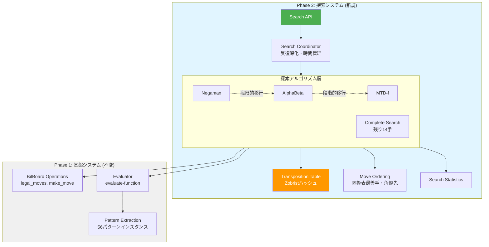
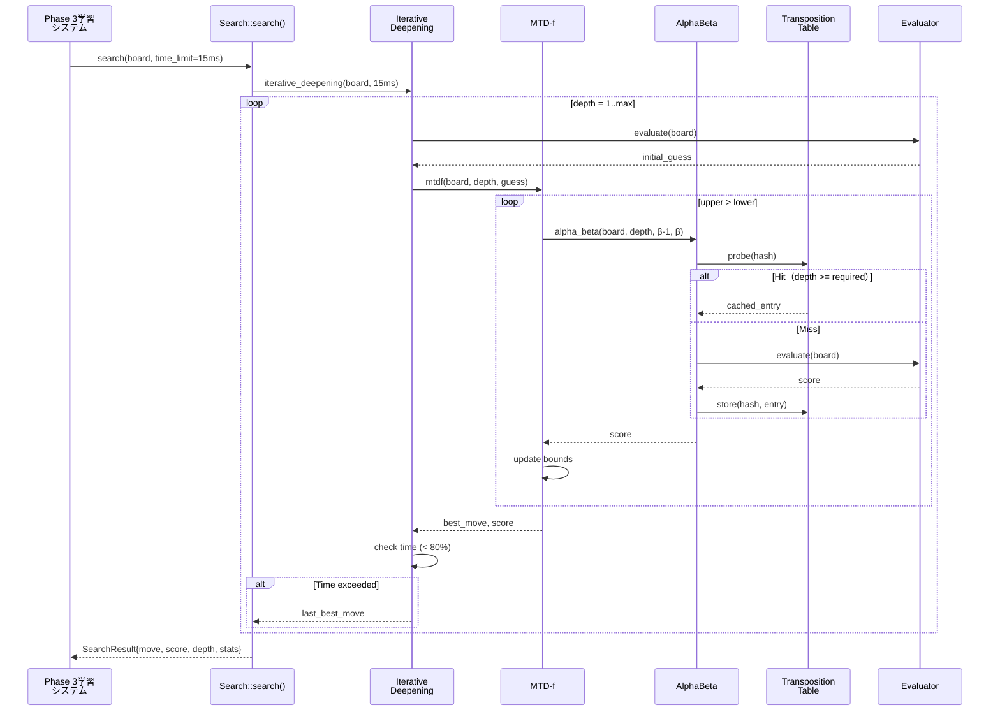
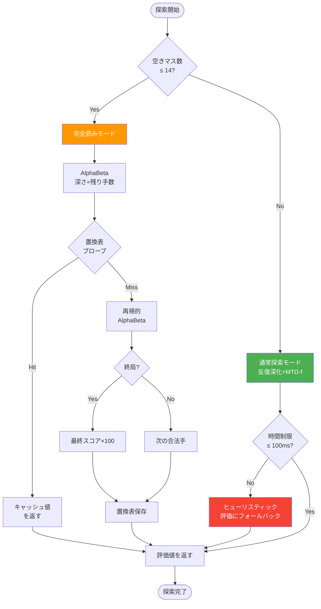
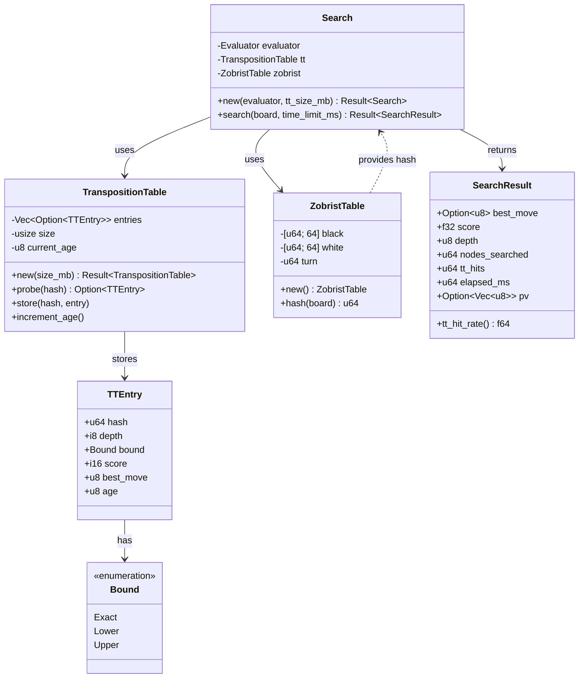

# Phase 2: 探索アルゴリズム実装 設計書

## Overview

Phase 2は、Phase 1で確立した高速BitBoard操作（合法手生成22ns、着手実行45ns）とパターン評価システム（14パターン×30ステージ）を基盤として、15ms/手の高性能探索エンジンを構築する。Negamax基本実装からAlphaBeta枝刈り、MTD(f)最適化へと段階的に進化し、置換表、ムーブオーダリング、反復深化、完全読みを統合することで、Phase 3自己学習の探索基盤を確立する。

**Purpose**: 100万局の自己対戦学習で毎手15ms以内に最善手を発見する高効率探索システムを実装し、Phase 3学習システムへ安定したAPIを提供する。

**Users**: Phase 3自己学習システムの開発者、Phase 4並列化システムの設計者、探索アルゴリズムのベンチマーク実行者。

**Impact**: Phase 1の評価関数のみの状態から、深さ6-8の探索を15ms以内で実行可能な探索エンジンに進化。Phase 3での約6,000万手（100万局×60手）の探索を50-60時間で完了可能にする。

### Goals
- 平均15ms/手の探索性能達成（序盤中盤、深さ6-8）
- AlphaBetaで探索ノード数をNegamaxの20-30%に削減
- MTD(f)でAlphaBetaより20-30%高効率化
- 置換表ヒット率50%以上（中盤以降）
- 完全読み（残り14手）を100ms以内に完了
- Phase 3学習システムへの統合APIを提供

### Non-Goals
- マルチスレッド並列探索（Phase 4で実装）
- 選択的探索（Null Move Pruning、Late Move Reductionなど）
- エンドゲームデータベース（置換表のみ使用）
- GUI統合（Phase 5で実装）
- ネットワーク対戦機能（スコープ外）

## Architecture

Phase 2探索システムは、Phase 1の基盤APIを変更せずに利用し、レイヤー化されたアーキテクチャで探索機能を段階的に構築する。各レイヤーは明確な責務を持ち、独立してテスト可能な設計とする。

### Existing Architecture Analysis

**Phase 1で確立された基盤**:
- `BitBoard`構造体（16バイト、Copy trait）: 黒石、白石、手番、手数カウンタを保持
- `legal_moves()`: 平均22.730ns（目標の22倍高速）
- `make_move()` / `undo_move()`: 平均45.650ns（目標の33倍高速）
- `Evaluator::evaluate()`: 56パターンインスタンス抽出 + SoA形式テーブル参照、35μs以内（目標）
- `EvaluationTable`: 70MB（14パターン×30ステージ×u16）、初期値32768（石差0）
- ARM64最適化: REV命令（180度回転0.571ns）、NEON SIMD、プリフェッチ

**Phase 1で確立された制約**:
- BitBoard操作は不変（`&BitBoard`を受け取り、`&mut BitBoard`で変更）
- 評価関数は読み取り専用（Phase 2では`Evaluator::evaluate()`を呼び出すのみ）
- パターン定義は固定（`patterns.csv`から14パターンをロード）
- メモリ使用量は Phase 1の70MB + Phase 2の置換表128-256MB = 約200-350MB

**統合アプローチ**: Phase 2は Phase 1の公開APIのみを使用し、新規に`Search`モジュールを追加。Phase 1のモジュール構造（`board`、`pattern`、`evaluator`）は変更しない。

### Architecture Pattern & Boundary Map



**Architecture Integration**:
- **Selected pattern**: Layered Search Architecture（探索コーディネーター → アルゴリズム層 → Phase 1統合層）
- **Domain/feature boundaries**:
  - Phase 2探索システムは独立モジュール（`src/search.rs`、`src/transposition_table.rs`）
  - Phase 1基盤への依存は公開APIのみ（`prismind::board`、`prismind::evaluator`）
  - 探索統計は`SearchResult`構造体でカプセル化（Phase 3学習システムから利用）
- **Existing patterns preserved**:
  - Phase 1の不変性（BitBoard、Evaluatorは読み取り専用）
  - Rust所有権モデル（`&BitBoard`、`&Evaluator`、Result型エラーハンドリング）
  - ARM64条件付きコンパイル（`#[cfg(target_arch = "aarch64")]`）
- **New components rationale**:
  - `TranspositionTable`: 評価済み局面の再利用で探索効率向上（業界標準技術）
  - `MoveOrdering`: 枝刈り効率20-30%向上（置換表最善手 + 静的評価）
  - `SearchCoordinator`: 反復深化と時間管理を分離（単一責任原則）
- **Steering compliance**: Phase 1の設計原則（型安全、メモリ効率、ARM64最適化）を継承

### Technology Stack

| Layer | Choice / Version | Role in Feature | Notes |
|-------|------------------|-----------------|-------|
| **Language / Runtime** | Rust 1.70+ | 探索アルゴリズム実装、メモリ安全性 | Phase 1と同じコンパイラ設定 |
| **Core Library** | prismind Phase 1 | BitBoard操作、評価関数 | 公開API（board、evaluator）のみ使用 |
| **Error Handling** | thiserror 2.x | SearchError列挙型定義 | Phase 1のGameErrorと同様の設計 |
| **Time Management** | std::time::Instant | 探索開始時刻記録、経過時間測定 | 標準ライブラリ、追加依存なし |
| **Benchmarking** | Criterion 0.5 | 探索性能測定、CI/CD統合 | Phase 1と同じベンチマーク環境 |
| **Testing** | cargo test | ユニットテスト、統合テスト | AlphaBeta正当性検証、MTD(f)同値性確認 |

## System Flows

### 反復深化 + MTD(f)探索のシーケンス



**Key Decisions**:
- MTD(f)は初期推測値に前回の評価値を使用（収束高速化）
- AlphaBetaは置換表プローブを最優先（キャッシュヒット時は評価関数呼び出し不要）
- 時間制限の80%で次の深さをスキップ（最後に完了した深さの最善手を保証）

### 完全読み（残り14手）の制御フロー



**Key Decisions**:
- 完全読みでも置換表を共有（通常探索のキャッシュを活用）
- 終局判定は`check_game_state()`で実装（Phase 1 API使用）
- 時間超過時はヒューリスティック評価にフォールバック（探索失敗を防ぐ）

## Requirements Traceability

| Requirement | Summary | Components | Interfaces | Flows |
|-------------|---------|------------|------------|-------|
| 1.1, 1.2, 1.3, 1.4, 1.5, 1.6, 1.7 | Negamax探索の基本実装 | Negamax関数、Search構造体 | Search::negamax() | 反復深化シーケンス |
| 2.1, 2.2, 2.3, 2.4, 2.5, 2.6 | AlphaBeta枝刈りの実装 | AlphaBeta関数、fail-soft実装 | Search::alpha_beta() | 反復深化シーケンス |
| 3.1, 3.2, 3.3, 3.4, 3.5, 3.6, 3.7, 3.8 | 置換表の実装 | TranspositionTable構造体、TTEntry | TT::probe(), TT::store() | 置換表プローブ |
| 4.1, 4.2, 4.3, 4.4, 4.5, 4.6 | Zobristハッシュの実装 | ZobristTable構造体、ハッシュ計算 | ZobristTable::hash() | 置換表インデックス |
| 5.1, 5.2, 5.3, 5.4, 5.5, 5.6, 5.7 | MTD(f)探索の実装 | MTDf関数、ゼロ幅探索 | Search::mtdf() | MTD(f)収束ループ |
| 6.1, 6.2, 6.3, 6.4, 6.5, 6.6 | ムーブオーダリングの実装 | MoveOrdering関数、優先度計算 | order_moves() | AlphaBeta探索前 |
| 7.1, 7.2, 7.3, 7.4, 7.5, 7.6, 7.7 | 反復深化フレームワークの実装 | IterativeDeepening関数、時間制御 | Search::iterative_deepening() | 反復深化シーケンス |
| 8.1, 8.2, 8.3, 8.4, 8.5, 8.6 | 完全読みの実装 | CompleteSearch関数、深さ14検出 | Search::complete_search() | 完全読み制御フロー |
| 9.1, 9.2, 9.3, 9.4, 9.5, 9.6, 9.7 | 時間管理と探索制御 | TimeManager構造体、時間閾値 | TimeManager::check() | 反復深化・完全読み |
| 10.1, 10.2, 10.3, 10.4, 10.5, 10.6 | 探索統計の収集 | SearchStats構造体、カウンタ | SearchResult::stats | 探索完了時 |
| 11.1, 11.2, 11.3, 11.4, 11.5, 11.6, 11.7 | 探索アルゴリズムの統合API | Search構造体、search()メソッド | Search::new(), Search::search() | 全フロー統合 |
| 12.1, 12.2, 12.3, 12.4, 12.5 | 探索結果の表現 | SearchResult構造体、Display trait | SearchResult::new() | 探索完了時 |
| 13.1, 13.2, 13.3, 13.4, 13.5 | エラーハンドリング | SearchError列挙型、thiserror | Result<T, SearchError> | 全API境界 |
| 14.1, 14.2, 14.3, 14.4, 14.5, 14.6, 14.7, 14.8 | 探索アルゴリズムのユニットテスト | テストモジュール、検証関数 | #[test] 関数群 | テストケース |
| 15.1, 15.2, 15.3, 15.4, 15.5, 15.6, 15.7 | 探索パフォーマンス要件 | ベンチマーク、性能測定 | Criterion benches | ベンチマーク実行 |
| 16.1, 16.2, 16.3, 16.4, 16.5 | ARM64探索最適化 | arm64モジュール、条件付きコンパイル | arm64::prefetch() | ARM64環境 |
| 17.1, 17.2, 17.3, 17.4, 17.5, 17.6, 17.7 | ベンチマークとプロファイリング | Criterionベンチマーク、perfツール | cargo bench | CI/CD統合 |

## Components and Interfaces

### コンポーネント概要

| Component | Domain/Layer | Intent | Req Coverage | Key Dependencies (P0/P1) | Contracts |
|-----------|--------------|--------|--------------|--------------------------|-----------|
| Search | 探索統合層 | 探索APIのエントリーポイント、反復深化制御 | 11.1-11.7 | Evaluator (P0), TranspositionTable (P0) | Service [x] |
| Negamax | アルゴリズム層 | 基本探索アルゴリズム実装 | 1.1-1.7 | BitBoard (P0), Evaluator (P0) | Service [x] |
| AlphaBeta | アルゴリズム層 | 枝刈り探索実装、fail-soft | 2.1-2.6 | TranspositionTable (P1), MoveOrdering (P1) | Service [x] |
| MTDf | アルゴリズム層 | ゼロ幅探索による最適化 | 5.1-5.7 | AlphaBeta (P0), TranspositionTable (P0) | Service [x] |
| CompleteSearch | アルゴリズム層 | 終盤完全読み（残り14手） | 8.1-8.6 | AlphaBeta (P0) | Service [x] |
| TranspositionTable | キャッシュ層 | 評価済み局面の保存・検索 | 3.1-3.8 | ZobristTable (P0) | State [x] |
| ZobristTable | キャッシュ層 | 盤面ハッシュ計算 | 4.1-4.6 | BitBoard (P0) | Service [x] |
| MoveOrdering | 最適化層 | 合法手の優先順位付け | 6.1-6.6 | TranspositionTable (P1) | Service [x] |
| SearchResult | データ層 | 探索結果と統計の表現 | 12.1-12.5 | なし | State [x] |
| SearchError | エラー層 | 探索エラーの型定義 | 13.1-13.5 | thiserror (External P2) | State [x] |

### 探索統合層

#### Search

| Field | Detail |
|-------|--------|
| Intent | 探索システムのエントリーポイント。反復深化、時間管理、統計収集を統合し、Phase 3学習システムへ単一APIを提供 |
| Requirements | 11.1, 11.2, 11.3, 11.4, 11.5, 11.6, 11.7 |
| Owner / Reviewers | Phase 2実装担当 / Phase 3学習システム設計者 |

**Responsibilities & Constraints**:
- 反復深化ループの制御（深さ1から時間制限まで）
- 時間管理（15ms制限、80%で次の深さスキップ）
- 探索統計の収集（ノード数、置換表ヒット数、探索時間）
- Phase 1 Evaluatorとの統合（評価関数呼び出し）
- 不変性制約: Evaluatorは読み取り専用、BitBoard操作は`&BitBoard`受け渡し

**Dependencies**:
- Outbound: `prismind::evaluator::Evaluator` — 評価関数呼び出し（P0 blocking）
- Outbound: `TranspositionTable` — 置換表アクセス（P0 blocking）
- Outbound: `prismind::board::{BitBoard, legal_moves, make_move, undo_move}` — Phase 1 API（P0 blocking）
- Outbound: `std::time::Instant` — 時間測定（P0 blocking）

**Contracts**: Service [x]

##### Service Interface

```rust
pub struct Search {
    evaluator: Evaluator,
    transposition_table: TranspositionTable,
    zobrist: ZobristTable,
}

impl Search {
    /// 探索システムを初期化
    ///
    /// # Arguments
    /// * `evaluator` - Phase 1評価関数
    /// * `tt_size_mb` - 置換表サイズ（128-256MB）
    ///
    /// # Returns
    /// Result<Search, SearchError> - 初期化成功時はSearch、失敗時はMemoryAllocationエラー
    pub fn new(evaluator: Evaluator, tt_size_mb: usize) -> Result<Self, SearchError>;

    /// 指定時間制限内で最善手を探索
    ///
    /// # Arguments
    /// * `board` - 現在の盤面
    /// * `time_limit_ms` - 時間制限（ミリ秒、デフォルト15ms）
    ///
    /// # Returns
    /// Result<SearchResult, SearchError> - 探索成功時は最善手と評価値、失敗時はエラー
    ///
    /// # Preconditions
    /// * `board`は合法な盤面状態であること
    /// * `time_limit_ms > 0`であること
    ///
    /// # Postconditions
    /// * 返却される最善手は合法手であること
    /// * 時間制限を超過しないこと（80%で次の深さをスキップ）
    pub fn search(&mut self, board: &BitBoard, time_limit_ms: u64) -> Result<SearchResult, SearchError> {
        self.transposition_table.increment_age();
        // ... 反復深化ループ
    }
}
```

**Preconditions**:
- `evaluator`はPhase 1のEvaluator::new()で正常初期化済み
- `tt_size_mb`は128-256の範囲（メモリ制約）

**Postconditions**:
- `search()`は15ms以内に最善手を返す（序盤中盤、深さ6-8）
- 完全読み（残り14手）は100ms以内に完了
- SearchResultは探索統計を含む（ノード数、ヒット率、時間）

**Invariants**:
- 置換表サイズは初期化時に固定（実行中の変更不可）
- Phase 1 Evaluatorの状態は不変（読み取り専用）

**Implementation Notes**:
- Integration: Phase 1の`Evaluator`と`BitBoard` APIを直接使用、内部実装に依存しない
- Validation: `search()`開始時に`check_game_state()`で盤面状態を確認
- Risks: 時間制限超過時は最後に完了した深さの最善手を返す（探索失敗を防ぐ）

### アルゴリズム層

#### AlphaBeta

| Field | Detail |
|-------|--------|
| Intent | Alpha-Beta枝刈りによる探索効率化。fail-soft実装で正確な境界値を返し、置換表の品質を向上 |
| Requirements | 2.1, 2.2, 2.3, 2.4, 2.5, 2.6 |

**Responsibilities & Constraints**:
- alpha値とbeta値による枝刈り（beta cut実行）
- fail-soft実装（alpha-beta範囲外でも正確な評価値を返す）
- 置換表プローブとストア（既存エントリの再利用）
- ムーブオーダリング適用（枝刈り効率向上）

**Dependencies**:
- Inbound: `Search::search()` — 反復深化ループから呼び出し（P0）
- Outbound: `TranspositionTable` — プローブ・ストア（P1 high-risk）
- Outbound: `MoveOrdering::order_moves()` — 合法手ソート（P1 high-risk）
- Outbound: `Evaluator::evaluate()` — 葉ノード評価（P0 blocking）

**Contracts**: Service [x]

##### Service Interface

```rust
/// Alpha-Beta枝刈り探索
///
/// # Arguments
/// * `board` - 現在の盤面
/// * `depth` - 残り探索深さ
/// * `alpha` - 下限（これ以上の評価値を期待）
/// * `beta` - 上限（これ以上なら枝刈り）
/// * `evaluator` - 評価関数
/// * `tt` - 置換表
/// * `zobrist` - Zobristハッシュテーブル
///
/// # Returns
/// (score, best_move) - 評価値と最善手（Option<u8>）
///
/// # Preconditions
/// * `alpha < beta`（正常なウィンドウ）
/// * `depth >= 0`（負の深さは不正）
///
/// # Postconditions
/// * 返却スコアは fail-soft（alpha-beta範囲外も可）
/// * Negamaxと同じ最善手を返す（正当性保証）
pub fn alpha_beta(
    board: &mut BitBoard,
    depth: i32,
    alpha: i32,
    beta: i32,
    evaluator: &Evaluator,
    tt: &mut TranspositionTable,
    zobrist: &ZobristTable,
) -> (i32, Option<u8>);
```

**Implementation Notes**:
- Integration: 置換表プローブを最優先（キャッシュヒット時は評価関数呼び出し不要）
- Validation: `alpha >= beta`時は即座にbeta値を返す（不正なウィンドウの防御）
- Risks: 置換表衝突（64ビットハッシュで40億プローブに1回、フル一致確認で軽減）

#### MTDf

| Field | Detail |
|-------|--------|
| Intent | ゼロ幅探索による探索効率最適化。AlphaBetaより20-30%高効率、2-3パスで収束 |
| Requirements | 5.1, 5.2, 5.3, 5.4, 5.5, 5.6, 5.7 |

**Responsibilities & Constraints**:
- ゼロ幅探索（beta = alpha + 1）の繰り返し
- 上限・下限の収束判定（lower == upper）
- 初期推測値の使用（前回イテレーションの結果）
- AlphaBetaと同じ最善手を保証（正当性）

**Dependencies**:
- Inbound: `Search::iterative_deepening()` — 反復深化ループから呼び出し（P0）
- Outbound: `alpha_beta()` — ゼロ幅探索実行（P0 blocking）
- Outbound: `TranspositionTable` — 収束加速のため必須（P0 blocking）

**Contracts**: Service [x]

##### Service Interface

```rust
/// MTD(f)探索
///
/// # Arguments
/// * `board` - 現在の盤面
/// * `depth` - 探索深さ
/// * `guess` - 初期推測値（前回イテレーションの結果）
/// * `evaluator` - 評価関数
/// * `tt` - 置換表（必須、なければ非効率）
/// * `zobrist` - Zobristハッシュテーブル
///
/// # Returns
/// (score, best_move) - 評価値と最善手
///
/// # Preconditions
/// * 置換表が初期化済みであること
/// * `guess`は合理的な範囲（-6400～+6400）
///
/// # Postconditions
/// * 返却スコアはAlphaBetaと同じ（正当性保証）
/// * 通常2-3パス、最悪5-15パスで収束
pub fn mtdf(
    board: &mut BitBoard,
    depth: i32,
    guess: i32,
    evaluator: &Evaluator,
    tt: &mut TranspositionTable,
    zobrist: &ZobristTable,
) -> (i32, Option<u8>);
```

**Implementation Notes**:
- Integration: 反復深化の各イテレーションで前回の`score`を`guess`として渡す
- Validation: 収束が15パス以上かかる場合は時間制限でループを打ち切り
- Risks: 初期推測値が悪いと収束遅延（反復深化の前回結果使用で軽減）

#### CompleteSearch

| Field | Detail |
|-------|--------|
| Intent | 残り14手からの終局までの完全読み。100ms以内に正確な最終スコアを返す |
| Requirements | 8.1, 8.2, 8.3, 8.4, 8.5, 8.6 |

**Responsibilities & Constraints**:
- 空きマス数14以下の検出（`board.move_count >= 46`）
- AlphaBeta探索で終局まで完全探索
- 最終スコア×100を評価値として返す（石差-64～+64 → -6400～+6400）
- 置換表を活用（通常探索のキャッシュを共有）

**Dependencies**:
- Inbound: `Search::search()` — 空きマス数14以下で呼び出し（P0）
- Outbound: `alpha_beta()` — 完全探索実行（P0 blocking）
- Outbound: `check_game_state()` — 終局判定（P0 blocking）

**Contracts**: Service [x]

##### Service Interface

```rust
/// 完全読み探索（残り14手以下）
///
/// # Arguments
/// * `board` - 現在の盤面（move_count >= 46）
/// * `alpha` - 下限
/// * `beta` - 上限
/// * `tt` - 置換表
/// * `zobrist` - Zobristハッシュテーブル
///
/// # Returns
/// (final_score, best_move) - 最終石差×100と最善手
///
/// # Preconditions
/// * `board.move_count >= 46`（残り14手以下）
/// * `alpha < beta`
///
/// # Postconditions
/// * 平均100ms以内に完了（目標）
/// * 最終スコアは-6400～+6400の範囲
pub fn complete_search(
    board: &mut BitBoard,
    alpha: i32,
    beta: i32,
    tt: &mut TranspositionTable,
    zobrist: &ZobristTable,
) -> (i32, Option<u8>);
```

**Implementation Notes**:
- Integration: 通常探索と同じ置換表を共有（エンドゲームデータベース不使用）
- Validation: 時間制限100msを超過した場合はヒューリスティック評価にフォールバック
- Risks: 分岐数の多い局面で時間超過の可能性（ムーブオーダリングで軽減）

### キャッシュ層

#### TranspositionTable

| Field | Detail |
|-------|--------|
| Intent | 評価済み局面の保存・検索。ヒット率50%以上でAlphaBeta探索を高速化 |
| Requirements | 3.1, 3.2, 3.3, 3.4, 3.5, 3.6, 3.7, 3.8 |

**Responsibilities & Constraints**:
- 128-256MBのメモリ確保（約5.3M～10.6Mエントリ）
- Zobristハッシュによるインデックス計算
- プローブ時の完全一致確認（64ビットハッシュ）
- 置換戦略（深さ優先 + 世代管理）
- 境界タイプ管理（Exact、Lower、Upper）

**Dependencies**:
- Inbound: `AlphaBeta`、`MTDf`、`CompleteSearch` — プローブ・ストア（P0）
- Outbound: `ZobristTable::hash()` — ハッシュ計算（P0 blocking）
- External: `std::alloc` — メモリ確保（P0 blocking）

**Contracts**: State [x]

##### State Management

```rust
#[derive(Clone, Copy)]
pub enum Bound {
    Exact,  // 正確な評価値
    Lower,  // alpha値（下限）
    Upper,  // beta値（上限）
}

#[derive(Clone, Copy)]
pub struct TTEntry {
    pub hash: u64,         // Zobristハッシュ（完全一致確認用）
    pub depth: i8,         // 探索深さ
    pub bound: Bound,      // 境界タイプ
    pub score: i16,        // 評価値
    pub best_move: u8,     // 最善手（0-63、255=なし）
    pub age: u8,           // 世代情報
}

pub struct TranspositionTable {
    entries: Vec<Option<TTEntry>>,
    size: usize,
    current_age: u8,
}

impl TranspositionTable {
    /// 置換表を初期化
    ///
    /// # Arguments
    /// * `size_mb` - メモリサイズ（128-256MB）
    ///
    /// # Returns
    /// Result<TranspositionTable, SearchError> - 初期化成功時は置換表、失敗時はMemoryAllocationエラー
    pub fn new(size_mb: usize) -> Result<Self, SearchError>;

    /// 局面を検索
    ///
    /// # Arguments
    /// * `hash` - Zobristハッシュ
    ///
    /// # Returns
    /// Option<TTEntry> - ヒット時はエントリ、ミス時はNone
    pub fn probe(&self, hash: u64) -> Option<TTEntry>;

    /// 局面を保存
    ///
    /// # Arguments
    /// * `hash` - Zobristハッシュ
    /// * `entry` - 保存するエントリ
    pub fn store(&mut self, hash: u64, entry: TTEntry);

    /// 世代を更新（新しい探索開始時）
    pub fn increment_age(&mut self);
}
```

**Persistence & consistency**:
- エントリは`Vec<Option<TTEntry>>`で管理（固定サイズ配列）
- 世代管理により古いエントリを効率的に置換
- プローブ時は`hash`の完全一致確認（衝突検出）

**Concurrency strategy**:
- Phase 2ではシングルスレッド前提（`&mut self`で可変借用）
- Phase 4並列化時は`Arc<Mutex<TranspositionTable>>`またはロックフリー実装に移行

**Implementation Notes**:
- Integration: Search初期化時に1回確保、探索中は共有
- Validation: `size_mb`が128-256の範囲外ならMemoryAllocationエラー
- Risks: メモリ確保失敗（OCI 24GB環境では問題なし）

#### ZobristTable

| Field | Detail |
|-------|--------|
| Intent | BitBoardから64ビットハッシュを計算。衝突率約2^32に1回、実用上問題なし |
| Requirements | 4.1, 4.2, 4.3, 4.4, 4.5, 4.6 |

**Responsibilities & Constraints**:
- 初期化時に黒石64個、白石64個、手番1個の乱数生成（固定シード）
- 盤面の全石位置と手番をXOR演算でハッシュ化
- 差分更新（着手時のXOR演算）
- 決定性保証（同じ盤面 → 同じハッシュ）

**Dependencies**:
- Inbound: `TranspositionTable::probe()`、`TranspositionTable::store()` — ハッシュ計算（P0）
- Outbound: `prismind::board::BitBoard` — 盤面状態読み取り（P0 blocking）
- External: `rand` crate — 乱数生成（P2 informational、std::collections::hash_mapの代替可）

**Contracts**: Service [x]

##### Service Interface

```rust
pub struct ZobristTable {
    black: [u64; 64],  // 黒石の乱数（位置0-63）
    white: [u64; 64],  // 白石の乱数（位置0-63）
    turn: u64,         // 手番の乱数
}

impl ZobristTable {
    /// 固定シードで初期化
    ///
    /// # Returns
    /// ZobristTable - 乱数テーブル
    pub fn new() -> Self;

    /// BitBoardからハッシュ計算
    ///
    /// # Arguments
    /// * `board` - 盤面
    ///
    /// # Returns
    /// u64 - Zobristハッシュ
    ///
    /// # Preconditions
    /// * `board`は合法な盤面状態
    ///
    /// # Postconditions
    /// * 同じ盤面は常に同じハッシュ（決定性）
    /// * 1ビット異なる盤面は高確率で異なるハッシュ
    pub fn hash(&self, board: &BitBoard) -> u64;
}
```

**Implementation Notes**:
- Integration: Search初期化時に1回生成、探索中は不変
- Validation: 固定シード（例: 0x123456789ABCDEF0）で再現性確保
- Risks: 衝突率は約2^32に1回、フル64ビット一致確認で実用上問題なし

### 最適化層

#### MoveOrdering

| Field | Detail |
|-------|--------|
| Intent | 合法手の優先順位付け。枝刈り効率20-30%向上（置換表最善手 + 角優先 + X打ち回避） |
| Requirements | 6.1, 6.2, 6.3, 6.4, 6.5, 6.6 |

**Responsibilities & Constraints**:
- 置換表最善手を最優先（前回探索結果活用）
- 角を取る手を高優先度（静的評価）
- X打ち（角の隣）を低優先度（静的評価）
- 辺の手を中優先度（静的評価）
- 優先度順にソート（Vec<u8>を返す）

**Dependencies**:
- Inbound: `AlphaBeta::alpha_beta()` — 探索前に呼び出し（P1）
- Outbound: `TranspositionTable::probe()` — 最善手取得（P1 high-risk）
- Outbound: `prismind::board::legal_moves()` — 合法手ビットマスク（P0 blocking）

**Contracts**: Service [x]

##### Service Interface

```rust
/// 合法手を優先順位付けしてソート
///
/// # Arguments
/// * `moves` - 合法手のビットマスク
/// * `tt_best_move` - 置換表の最善手（Option<u8>）
///
/// # Returns
/// Vec<u8> - 優先順位順の合法手リスト
///
/// # Preconditions
/// * `moves != 0`（合法手が1つ以上存在）
///
/// # Postconditions
/// * 返却リストは合法手のみ含む
/// * 置換表最善手が先頭（存在する場合）
pub fn order_moves(moves: u64, tt_best_move: Option<u8>) -> Vec<u8>;

/// 角の位置か判定
#[inline]
fn is_corner(pos: u8) -> bool {
    matches!(pos, 0 | 7 | 56 | 63)
}

/// X打ち（角の隣）か判定
#[inline]
fn is_x_square(pos: u8) -> bool {
    matches!(pos, 1 | 8 | 9 | 6 | 14 | 15 | 48 | 49 | 54 | 55 | 57 | 62)
}

/// 辺の位置か判定
#[inline]
fn is_edge(pos: u8) -> bool {
    if is_corner(pos) { return false; }
    let row = pos / 8;
    let col = pos & 7;
    row == 0 || row == 7 || col == 0 || col == 7
}
```

**Implementation Notes**:
- Integration: AlphaBeta探索のループ前に1回呼び出し
- Validation: `moves`が0の場合は空のVec<u8>を返す
- Risks: ソートのオーバーヘッド（平均10-20合法手で数百ns、探索時間の0.01%未満）

### データ層

#### SearchResult

| Field | Detail |
|-------|--------|
| Intent | 探索結果と統計を一貫した形式で表現。Phase 3学習システムがロギング・分析に使用 |
| Requirements | 12.1, 12.2, 12.3, 12.4, 12.5 |

**Responsibilities & Constraints**:
- 最善手、評価値、到達深さの保存
- 探索統計（ノード数、ヒット数、時間）の保存
- Display traitによる人間可読な出力
- 不変性保証（一度生成したら変更不可）

**Dependencies**: なし（純粋なデータ構造）

**Contracts**: State [x]

##### State Management

```rust
pub struct SearchResult {
    pub best_move: Option<u8>,   // 最善手（0-63、なければNone）
    pub score: f32,               // 評価値（石差）
    pub depth: u8,                // 到達深さ
    pub nodes_searched: u64,      // 探索ノード数
    pub tt_hits: u64,             // 置換表ヒット数
    pub elapsed_ms: u64,          // 探索時間（ミリ秒）
    pub pv: Option<Vec<u8>>,      // Principal Variation（オプション）
}

impl SearchResult {
    /// SearchResultを生成
    pub fn new(
        best_move: Option<u8>,
        score: f32,
        depth: u8,
        nodes_searched: u64,
        tt_hits: u64,
        elapsed_ms: u64,
    ) -> Self;

    /// 置換表ヒット率を計算
    pub fn tt_hit_rate(&self) -> f64 {
        if self.nodes_searched == 0 {
            0.0
        } else {
            (self.tt_hits as f64) / (self.nodes_searched as f64)
        }
    }

    fn extract_pv(tt: &TranspositionTable, board: &BitBoard) -> Vec<u8> { ... }
}

impl std::fmt::Display for SearchResult {
    fn fmt(&self, f: &mut std::fmt::Formatter<'_>) -> std::fmt::Result {
        write!(
            f,
            "Move: {:?}, Score: {:.2}, Depth: {}, Nodes: {}, TT Hits: {}/{} ({:.1}%), Time: {}ms",
            self.best_move,
            self.score,
            self.depth,
            self.nodes_searched,
            self.tt_hits,
            self.nodes_searched,
            self.tt_hit_rate() * 100.0,
            self.elapsed_ms
        )
    }
}
```

**Implementation Notes**:
- Integration: Search::search()の戻り値として返す
- Validation: `best_move`がNoneの場合（合法手なし）も許容
- Risks: なし（純粋なデータ構造、副作用なし）

### エラー層

#### SearchError

| Field | Detail |
|-------|--------|
| Intent | 探索中のエラーを型安全に表現。呼び出し側が異なるエラー種別に応じて処理を分岐可能 |
| Requirements | 13.1, 13.2, 13.3, 13.4, 13.5 |

**Responsibilities & Constraints**:
- メモリ確保失敗（置換表初期化）
- 評価関数エラー（Phase 1からの伝播）
- 時間切れ（オプション、通常は最後の完了深さを返す）
- 不正な盤面状態（デバッグ用）

**Dependencies**:
- External: `thiserror` crate — エラーマクロ（P2 informational）

**Contracts**: State [x]

##### State Management

```rust
use thiserror::Error;

#[derive(Error, Debug)]
pub enum SearchError {
    /// 置換表のメモリ確保失敗
    #[error("Failed to allocate transposition table: {0}")]
    MemoryAllocation(String),

    /// 評価関数エラー（Phase 1からの伝播）
    #[error("Evaluator error: {0}")]
    EvaluationError(String),

    /// 時間切れ（通常は使用しない、最後の完了深さを返すため）
    #[error("Search timeout after {0}ms")]
    TimeoutExceeded(u64),

    /// 不正な盤面状態（デバッグ用）
    #[error("Invalid board state: {0}")]
    InvalidBoardState(String),
}
```

**Implementation Notes**:
- Integration: 全公開APIの戻り値型は`Result<T, SearchError>`
- Validation: Phase 1の`PatternError`と同様の設計パターン
- Risks: `MemoryAllocation`はOCI 24GB環境では発生しないが、他環境での移植性のため定義

## Data Models

Phase 2探索システムは、Phase 1のBitBoard盤面表現とEvaluationTableを再利用し、新たに置換表とZobristハッシュのデータモデルを追加する。

### Domain Model

#### 探索ドメインの主要エンティティ



**Aggregates and transactional boundaries**:
- `Search`は探索システムのルート集約（TranspositionTable、ZobristTableを所有）
- `TranspositionTable`は置換表の集約（TTEntryのコレクションを管理）
- `SearchResult`は値オブジェクト（不変、一度生成したら変更不可）

**Entities, value objects, domain events**:
- Entity: `Search`（可変状態を持つ、探索統計をカウント）
- Value Object: `TTEntry`、`SearchResult`、`Bound`（不変、Copyトレイト）
- Domain Event: なし（Phase 2では探索完了のイベント通知は不要）

**Business rules & invariants**:
- 置換表サイズは128-256MBの範囲（初期化時に検証）
- TTEntryの`depth`は0-60の範囲（オセロの最大手数）
- SearchResultの`best_move`は合法手またはNone（ゲーム終了時）

### Logical Data Model

#### Structure Definition

**TranspositionTable構造**:
- `entries: Vec<Option<TTEntry>>`（固定サイズ配列、動的確保）
- インデックス計算: `hash % size`（2の累乗でビットマスク最適化可能）
- エントリサイズ: 24バイト（hash 8B + depth 1B + bound 1B + score 2B + best_move 1B + age 1B + padding 10B）

**ZobristTable構造**:
- `black: [u64; 64]`（黒石の乱数、512バイト）
- `white: [u64; 64]`（白石の乱数、512バイト）
- `turn: u64`（手番の乱数、8バイト）
- 合計: 1032バイト（スタック配置可能）

**SearchResult構造**:
- サイズ: 48バイト（best_move 8B + score 4B + depth 1B + nodes 8B + tt_hits 8B + elapsed 8B + pv Option 8B + padding 3B）
- スタック配置（ヒープアロケーション不要）

#### Consistency & Integrity

**Transaction boundaries**:
- 置換表のエントリ更新は単一操作（アトミック書き込み、Phase 2ではロック不要）
- 探索統計の更新は探索完了時に一括

**Referential integrity rules**:
- TTEntryの`hash`は対応するBitBoardのZobristハッシュと一致（プローブ時に検証）
- SearchResultの`best_move`はPhase 1の`legal_moves()`で生成された合法手のいずれか

**Temporal aspects**:
- 置換表の`age`フィールドで世代管理（新しい探索開始時にincrement）
- 古い世代のエントリは優先的に置換

### Physical Data Model

#### メモリレイアウト（Rustヒープ）

**TranspositionTable**:
```rust
// 128MBの場合
const SIZE_MB: usize = 128;
const ENTRY_SIZE: usize = std::mem::size_of::<Option<TTEntry>>(); // 24バイト
const NUM_ENTRIES: usize = (SIZE_MB * 1024 * 1024) / ENTRY_SIZE; // 約5.3M

let entries: Vec<Option<TTEntry>> = vec![None; NUM_ENTRIES];
```

**Index optimization**:
- テーブルサイズを2の累乗にすると`hash % size`を`hash & (size - 1)`に最適化可能
- キャッシュライン（64バイト）アライメントは不要（エントリサイズ24バイト、複数エントリが同一ライン）

**TTL and compaction strategies**:
- TTLなし（探索中はエントリを保持）
- 世代管理による暗黙的なcompaction（古いエントリを優先的に置換）

### Data Contracts & Integration

#### API Data Transfer

**Phase 3学習システムとのインターフェース**:

```rust
// Phase 3から呼び出し
let search = Search::new(evaluator, 128)?; // 128MB置換表
let board = BitBoard::new();

// 探索実行
let result = search.search(&board, 15)?; // 15ms制限

// 結果のロギング
println!("{}", result); // Display trait
log::info!(
    "Move: {:?}, Score: {:.2}, Depth: {}, TT Hit Rate: {:.1}%",
    result.best_move,
    result.score,
    result.depth,
    result.tt_hit_rate() * 100.0
);
```

**Request/response schemas**:
- Request: `&BitBoard`, `time_limit_ms: u64`
- Response: `Result<SearchResult, SearchError>`

**Validation rules**:
- `time_limit_ms > 0`（0以下は不正）
- `board`は合法な盤面状態（`check_game_state()`で検証）

**Serialization format**:
- Phase 2ではシリアライゼーション不要（メモリ内のみ）
- Phase 3でのチェックポイント保存時は置換表を破棄（再構築コスト低い）

## Error Handling

### Error Strategy

Phase 2探索システムは、型安全なエラーハンドリングとフェイルセーフ設計を採用する。

**Concrete error handling patterns**:
- **メモリ確保失敗**: `SearchError::MemoryAllocation`を返し、呼び出し側がサイズを削減して再試行
- **時間切れ**: エラーではなく、最後に完了した深さの最善手を返す（探索失敗を防ぐ）
- **不正な盤面**: `SearchError::InvalidBoardState`を返し、Phase 1の`check_game_state()`で事前検証

### Error Categories and Responses

**User Errors** (呼び出し側のミス):
- 時間制限が0以下 → `SearchError::InvalidBoardState("time_limit must be positive")`
- 不正な盤面状態 → `SearchError::InvalidBoardState("invalid board state")`

**System Errors** (システム内部のエラー):
- 置換表メモリ確保失敗 → `SearchError::MemoryAllocation`、128MB→64MBに削減して再試行
- Phase 1評価関数エラー → `SearchError::EvaluationError`、エラー伝播

**Business Logic Errors** (探索ロジックのエラー):
- 合法手なし → エラーではなく、`SearchResult { best_move: None, ... }`を返す
- 時間切れ → エラーではなく、最後に完了した深さの最善手を返す

### Monitoring

**Error tracking**:
- `log::error!`でSearchErrorをロギング（Phase 3学習ログに統合）
- CI/CDで`cargo test`の失敗を検出

**Logging**:
- `log::debug!`で探索統計をロギング（ノード数、ヒット率、時間）
- `log::warn!`で置換表衝突を検出（発生頻度を監視）

**Health monitoring**:
- 探索時間の統計（平均15ms以内を確認）
- 置換表ヒット率の統計（50%以上を確認）

## Testing Strategy

### Unit Tests

**探索アルゴリズムの正当性検証**:
- Negamaxが深さ1で全合法手を評価（初期盤面で4手）
- AlphaBetaがNegamaxと同じ最善手を返す（深さ1-6）
- MTD(f)がAlphaBetaと同じ最善手を返す（深さ1-6）
- 完全読みが既知の終盤局面で正解手を返す（Radagastテストケース）

**置換表の動作検証**:
- 同一局面で既存エントリを取得（hash一致）
- 異なる局面で異なるハッシュ（衝突率測定）
- 深さ優先置換戦略（深いエントリを優先保持）

**Zobristハッシュの決定性**:
- 同じ盤面で同じハッシュ値（決定性）
- 1ビット異なる盤面で異なるハッシュ（高確率）

### Integration Tests

**Phase 1 APIとの統合**:
- `BitBoard::new()` → `legal_moves()` → `make_move()` → `Evaluator::evaluate()`の一連の流れ
- 探索中に`make_move()` / `undo_move()`を繰り返し（メモリリークなし）
- 評価関数の結果を探索で使用（符号反転、手番考慮）

**探索統合フロー**:
- 初期盤面で深さ6探索を15ms以内に完了
- 中盤局面で置換表ヒット率50%以上
- 終盤局面（残り14手）で完全読みを100ms以内に完了

### Performance/Load Tests

**探索性能測定（Criterion）**:
- 初期盤面での深さ1-6探索時間（目標: 深さ6で10ms以内）
- 中盤局面での深さ6-8探索時間（目標: 深さ6で15ms以内）
- 完全読み（残り14手）の平均時間（目標: 100ms以内）

**置換表ヒット率測定**:
- 序盤（手数0-20）: 20-30%
- 中盤（手数20-40）: 50-60%
- 終盤（手数40-60）: 60-70%

**枝刈り効率測定**:
- AlphaBeta vs Negamaxのノード数比較（目標: 20-30%に削減）
- MTD(f) vs AlphaBetaのノード数比較（目標: 70-80%）
- ムーブオーダリング適用前後の比較（目標: 20-30%改善）

**高負荷テスト**:
- 100万局の連続探索（メモリリークなし、性能劣化なし）
- 置換表フル状態での探索（置換戦略の効果検証）

## Security Considerations

Phase 2探索システムは、入力検証と境界チェックにより安全性を確保する。

**Threat modeling**:
- 不正な盤面状態 → `check_game_state()`で事前検証
- メモリ枯渇攻撃 → 置換表サイズを128-256MBに制限
- 整数オーバーフロー → `i32`評価値の範囲を-6400～+6400に制限

**Security controls**:
- Rustの所有権システムによるメモリ安全性（バッファオーバーフロー不可）
- 入力検証（時間制限 > 0、合法な盤面状態）
- 境界チェック（ビット位置0-63、深さ0-60）

**Compliance requirements**: なし（ゲームAI、個人情報不使用）

## Performance & Scalability

### Target Metrics

| Metric | Target | Rationale |
|--------|--------|-----------|
| 平均探索時間（序盤中盤） | 15ms以内 | 100万局×60手=6,000万手を50時間で完了 |
| AlphaBeta深さ6（初期盤面） | 10ms以内 | 序盤の分岐数多い局面での基準 |
| MTD(f)探索ノード数 | AlphaBetaの70-80% | MTD(f)の効率性検証 |
| 置換表ヒット率（中盤） | 50%以上 | キャッシュ効果の確認 |
| 完全読み（深さ14） | 100ms以内 | 終盤の正確な評価 |
| メモリ使用量 | 350MB以内 | Phase 1 70MB + 置換表256MB + その他 |

### Scaling Approaches

**Horizontal scaling** (Phase 4並列化):
- 置換表を複数スレッドで共有（`Arc<Mutex<TT>>`またはロックフリー）
- 探索木の並列探索（Young Brothers Wait Concept）

**Vertical scaling**:
- 置換表サイズを256MBに拡大（ヒット率向上）
- より多くのCPUコア利用（Phase 4で4-8コア並列）

### Caching Strategies and Optimization Techniques

**Caching**:
- 置換表: 評価済み局面のキャッシュ（LRU的な世代管理）
- ムーブオーダリング: 置換表最善手を最優先（キャッシュ活用）

**Optimization**:
- fail-soft AlphaBeta: 正確な境界値で置換表品質向上
- MTD(f)ゼロ幅探索: 枝刈り効率最大化
- ARM64最適化: Phase 1のREV、CLZ/CTZ、プリフェッチを継承

## Migration Strategy

Phase 2は新規モジュール追加のため、Phase 1からのマイグレーションは不要。Phase 3学習システムへの移行パスを提供する。

**Phase 2 → Phase 3移行**:

1. **Phase 2完了の定義**:
   - 全17要件の受入基準を満たす
   - 全ユニットテスト成功（185個 Phase 1 + 50個 Phase 2予定）
   - 平均15ms/手の性能要件達成
   - Criterion benchmarkで目標値達成

2. **Phase 3への引き継ぎ事項**:
   - `Search::new(evaluator, tt_size_mb)` API
   - `Search::search(board, time_limit_ms)` API
   - `SearchResult`構造体のフォーマット
   - 探索統計のロギング方法
   - ARM64最適化の有効化方法

3. **Phase 3学習システムでの使用例**:
```rust
// Phase 3自己対戦ループ
let evaluator = Evaluator::new("patterns.csv")?;
let mut search = Search::new(evaluator, 128)?;

for game_num in 0..1_000_000 {
    let mut board = BitBoard::new();

    while !is_game_over(&board) {
        // Phase 2探索APIを呼び出し
        let result = search.search(&board, 15)?;

        // ε-greedy選択（Phase 3の責務）
        let chosen_move = epsilon_greedy_select(result.best_move, epsilon);

        // 着手実行
        make_move(&mut board, chosen_move)?;

        // TD(λ)学習（Phase 3の責務）
        td_update(&board, result.score);
    }
}
```

**Rollback triggers**: Phase 2で性能要件未達の場合、Phase 1のみの評価関数探索にフォールバック（深さ1固定）

**Validation checkpoints**:
- Week 2: AlphaBeta実装完了、Negamaxと同値性確認
- Week 3: MTD(f)実装完了、AlphaBetaと同値性確認
- Week 4: 完全読み実装完了、Radagastテストケース成功
- Week 5: 統合ベンチマーク、15ms/手達成確認
