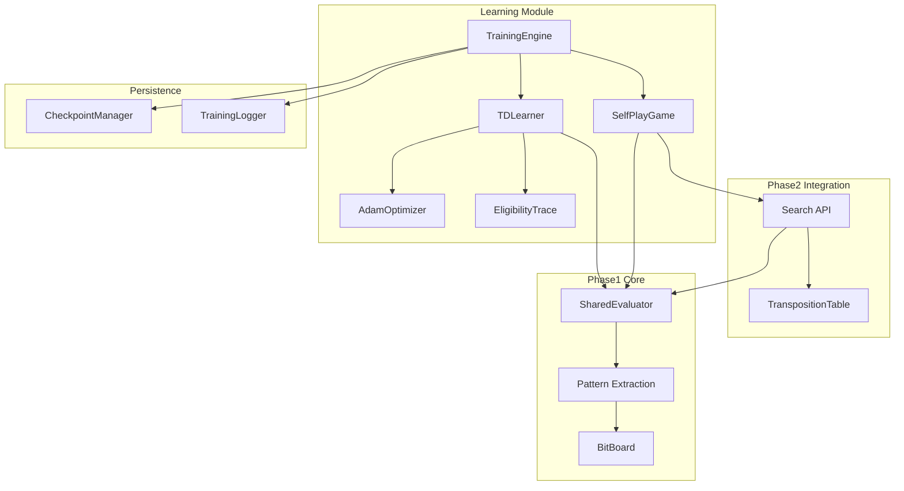
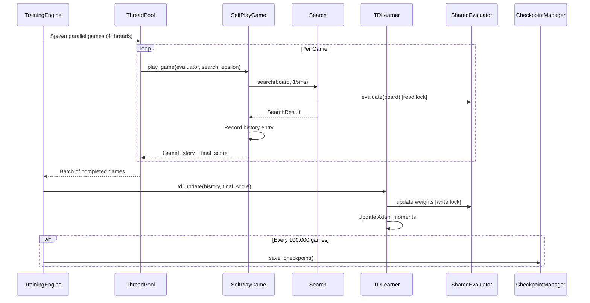
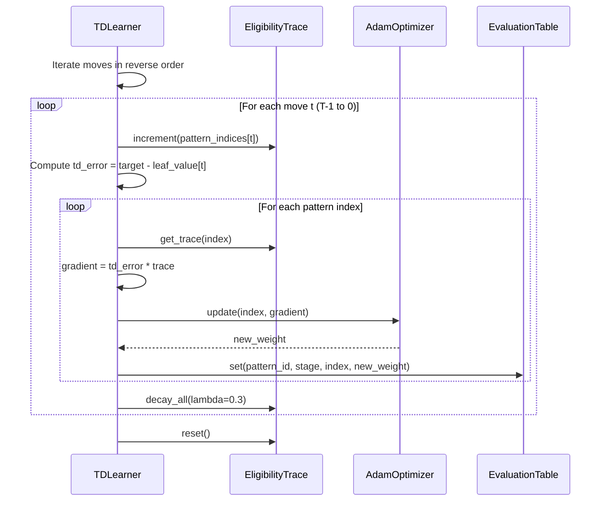

# Technical Design Document: Phase 3 Learning System

## Overview

**Purpose**: This feature delivers a TD(lambda)-Leaf reinforcement learning system to Othello AI developers and operators, enabling the AI to learn optimal move evaluation through 1 million games of self-play.

**Users**: Machine learning engineers utilize this system for training the evaluation function, while system operators monitor training progress and manage checkpoints on OCI Always Free infrastructure (ARM64, 4 cores, 24GB RAM).

**Impact**: Extends the Phase 2 Search system by adding learning capabilities that update the EvaluationTable weights based on game outcomes and intermediate evaluations, transforming the static evaluator into a trainable model.

### Goals

- Implement TD(lambda)-Leaf learning with lambda=0.3 and eligibility traces for credit assignment
- Integrate Adam optimizer (alpha=0.025, beta1=0.9, beta2=0.999) for stable gradient updates
- Build self-play engine with epsilon-greedy exploration achieving 4.6 games/second throughput
- Complete 1 million training games within 50-60 hours on 4-core ARM64
- Provide checkpoint management (every 100,000 games) and comprehensive logging

### Non-Goals

- GPU acceleration (out of scope for OCI Always Free)
- Distributed training across multiple machines
- Neural network-based evaluation (uses pattern tables only)
- Python training control interface (pure Rust implementation)
- Real-time game playing API (training mode only)

## Architecture

### Existing Architecture Analysis

Phase 3 extends the following Phase 1/2 components:

| Component | Current State | Extension Required |
|-----------|---------------|-------------------|
| `EvaluationTable` | Read-only pattern weights (57 MB) | Add mutable access with thread-safe updates |
| `Evaluator` | Stateless evaluation | Share between Search and Learning |
| `Search` | Independent game exploration | Reuse for move selection in self-play |
| `TranspositionTable` | Per-search lifecycle | Share across games, clear between epochs |
| `BitBoard` | Immutable game state | No changes required |

**Technical Debt Addressed**: The current `EvaluationTable` uses `get()`/`set()` methods suitable for single-threaded access. Phase 3 wraps this with `RwLock<EvaluationTable>` for safe concurrent reads during search and exclusive writes during TD updates.

### Architecture Pattern & Boundary Map



**Architecture Integration**:
- Selected pattern: **Shared State with RwLock** - balances parallel game execution with sequential weight updates
- Domain boundaries: Learning module owns training lifecycle; Phase 2 Search owns move selection; Phase 1 Evaluator is shared resource
- Existing patterns preserved: BitBoard immutability, Pattern extraction logic, Search API contract
- New components rationale: AdamOptimizer (stable learning), EligibilityTrace (credit assignment), CheckpointManager (fault tolerance)
- Steering compliance: Type-safe Rust, no Python dependency, ARM64 optimized

### Technology Stack

| Layer | Choice / Version | Role in Feature | Notes |
|-------|------------------|-----------------|-------|
| Backend | Rust 1.75+ | Core training engine | Existing stack |
| Concurrency | std::sync (RwLock, Mutex) | Thread-safe weight updates | No external crate |
| Parallelism | rayon 1.10+ | Parallel game execution | Add to Cargo.toml |
| Serialization | bincode 2.0+ | Checkpoint binary format | Add to Cargo.toml |
| Logging | log 0.4 + env_logger | Training statistics output | Add to Cargo.toml |
| Random | rand 0.9 | Epsilon-greedy exploration | Existing dev-dependency, promote to dependency |
| Time | std::time | Performance measurement | Standard library |

## System Flows

### Training Loop Flow



**Key Decisions**:
- Games execute in parallel, but TD updates are sequential to maintain weight consistency
- Read locks allow concurrent evaluation during search
- Write lock is acquired only during the TD update phase (brief, ~10ms per game)

### TD-Leaf Update Flow



## Requirements Traceability

| Requirement | Summary | Components | Interfaces | Flows |
|-------------|---------|------------|------------|-------|
| 1.1-1.8 | TD(lambda)-Leaf algorithm | TDLearner | TDLearner::update() | TD-Leaf Update Flow |
| 2.1-2.6 | Eligibility Trace management | EligibilityTrace | increment(), decay(), get(), reset() | TD-Leaf Update Flow |
| 3.1-3.10 | Adam optimizer | AdamOptimizer | update() | TD-Leaf Update Flow |
| 4.1-4.10 | Self-play game engine | SelfPlayGame, EpsilonSchedule | play_game() | Training Loop Flow |
| 5.1-5.7 | Game history recording | GameHistory, MoveRecord | push(), iter_reverse() | Training Loop Flow |
| 6.1-6.10 | Checkpoint management | CheckpointManager | save(), load(), verify() | Training Loop Flow |
| 7.1-7.8 | Training statistics logging | TrainingLogger | log_batch(), log_checkpoint() | Training Loop Flow |
| 8.1-8.7 | Memory management | All components | Memory budgets | Architecture |
| 9.1-9.7 | Phase 2 integration | SharedEvaluator, Search | search(), evaluate() | Training Loop Flow |
| 10.1-10.6 | Convergence monitoring | ConvergenceMonitor | track(), report() | Training Loop Flow |
| 11.1-11.7 | Score representation | u16/f32 conversion | u16_to_score(), score_to_u16() | Existing Phase 1 |
| 12.1-12.7 | Error handling | All components | Result types | Training Loop Flow |
| 13.1-13.8 | Performance requirements | TrainingEngine | Throughput metrics | Training Loop Flow |

## Components and Interfaces

| Component | Domain/Layer | Intent | Req Coverage | Key Dependencies | Contracts |
|-----------|--------------|--------|--------------|------------------|-----------|
| TrainingEngine | Learning/Core | Orchestrates parallel training loop | 4.10, 13.1-13.8 | SelfPlayGame, TDLearner, CheckpointManager | Service |
| TDLearner | Learning/Algorithm | Computes TD-Leaf updates with eligibility traces | 1.1-1.8, 2.1-2.6 | AdamOptimizer, EligibilityTrace, SharedEvaluator | Service |
| AdamOptimizer | Learning/Algorithm | Applies adaptive learning rate updates | 3.1-3.10 | None | Service |
| SelfPlayGame | Learning/Game | Plays single self-play game with epsilon-greedy | 4.1-4.9, 5.1-5.7 | Search, SharedEvaluator | Service |
| EligibilityTrace | Learning/Algorithm | Sparse trace storage for credit assignment | 2.1-2.6 | None | State |
| GameHistory | Learning/Data | Records moves for backward TD update | 5.1-5.7 | None | State |
| SharedEvaluator | Learning/Integration | Thread-safe evaluator wrapper | 9.1-9.7 | EvaluationTable (Phase 1) | State |
| CheckpointManager | Persistence | Saves/loads training state | 6.1-6.10 | AdamOptimizer, SharedEvaluator | Service |
| TrainingLogger | Persistence | Outputs training statistics | 7.1-7.8 | None | Service |
| ConvergenceMonitor | Learning/Monitoring | Tracks learning progress | 10.1-10.6 | None | Service |
| EpsilonSchedule | Learning/Config | Computes epsilon for game number | 4.3-4.5 | None | Service |

### Learning Module

#### TrainingEngine

| Field | Detail |
|-------|--------|
| Intent | Orchestrates the complete training loop, managing parallel game execution and sequential TD updates |
| Requirements | 4.10, 13.1-13.8 |

**Responsibilities & Constraints**
- Owns the training lifecycle from initialization to completion
- Manages thread pool for parallel game execution (4 threads for 4-core ARM64)
- Coordinates sequential TD updates after each batch of games
- Enforces memory budget of 600 MB total

**Dependencies**
- Inbound: None (top-level orchestrator)
- Outbound: SelfPlayGame, TDLearner, CheckpointManager, TrainingLogger (P0)
- External: rayon ThreadPool (P0)

**Contracts**: Service [x]

##### Service Interface

```rust
/// Main training engine for self-play learning
pub struct TrainingEngine {
    evaluator: Arc<RwLock<EvaluationTable>>,
    adam: AdamOptimizer,
    checkpoint_mgr: CheckpointManager,
    logger: TrainingLogger,
    convergence: ConvergenceMonitor,
    config: TrainingConfig,
}

impl TrainingEngine {
    /// Initialize training engine with optional checkpoint resume
    pub fn new(config: TrainingConfig) -> Result<Self, LearningError>;

    /// Resume training from checkpoint
    pub fn resume(checkpoint_path: &Path, config: TrainingConfig) -> Result<Self, LearningError>;

    /// Run training loop for specified number of games
    pub fn train(&mut self, target_games: u64) -> Result<TrainingStats, LearningError>;

    /// Graceful shutdown, saving checkpoint
    pub fn shutdown(&mut self) -> Result<(), LearningError>;
}

/// Training configuration
pub struct TrainingConfig {
    pub tt_size_mb: usize,           // Transposition table size (128-256 MB)
    pub num_threads: usize,          // Parallel game threads (default: 4)
    pub checkpoint_interval: u64,    // Games between checkpoints (default: 100,000)
    pub log_interval: u64,           // Games between batch logs (default: 100)
    pub search_time_ms: u64,         // Time limit per move (default: 15)
    pub lambda: f32,                 // TD decay parameter (default: 0.3)
    pub checkpoint_dir: PathBuf,     // Checkpoint output directory
    pub log_dir: PathBuf,            // Log output directory
}
```
- Preconditions: patterns.csv exists and is valid
- Postconditions: Training state is consistent; checkpoint saved on shutdown
- Invariants: Total memory usage <= 600 MB

**Implementation Notes**
- Integration: Uses rayon::ThreadPoolBuilder for parallel game execution
- Validation: Verifies memory budget before allocation
- Risks: OOM on insufficient memory; mitigate by reducing TT size

---

#### TDLearner

| Field | Detail |
|-------|--------|
| Intent | Implements TD(lambda)-Leaf learning algorithm with backward eligibility trace updates |
| Requirements | 1.1-1.8, 2.1-2.6 |

**Responsibilities & Constraints**
- Computes TD error between target and leaf evaluation
- Applies lambda=0.3 trace decay for credit assignment
- Updates all 56 pattern instances per position
- Accounts for side-to-move with value negation

**Dependencies**
- Inbound: TrainingEngine (P0)
- Outbound: AdamOptimizer (P0), EligibilityTrace (P0), SharedEvaluator (P0)
- External: None

**Contracts**: Service [x]

##### Service Interface

```rust
/// TD-Leaf learner with eligibility traces
pub struct TDLearner {
    lambda: f32,
    trace: EligibilityTrace,
}

impl TDLearner {
    /// Create new TD learner with specified lambda
    pub fn new(lambda: f32) -> Self;

    /// Perform TD update for completed game
    /// Updates weights in evaluator via Adam optimizer
    pub fn update(
        &mut self,
        history: &GameHistory,
        final_score: f32,
        evaluator: &mut EvaluationTable,
        adam: &mut AdamOptimizer,
    ) -> TDUpdateStats;
}

/// Statistics from TD update
pub struct TDUpdateStats {
    pub moves_processed: usize,
    pub patterns_updated: u64,
    pub avg_td_error: f32,
    pub max_td_error: f32,
}
```
- Preconditions: history.len() > 0; final_score in valid range
- Postconditions: All visited pattern entries updated; traces reset
- Invariants: Updated weights clamped to u16 range [0, 65535]

**Implementation Notes**
- Integration: Iterates history in reverse order (T-1 to 0)
- Validation: Clamps gradient to prevent extreme updates
- Risks: Gradient explosion; mitigate with gradient clipping

---

#### AdamOptimizer

| Field | Detail |
|-------|--------|
| Intent | Implements Adam optimizer for stable weight updates with momentum and adaptive learning rate |
| Requirements | 3.1-3.10 |

**Responsibilities & Constraints**
- Maintains first moment (m) and second moment (v) for each pattern entry
- Applies bias correction for early timesteps
- Memory budget: 228 MB (m: 114 MB + v: 114 MB)
- Global timestep counter for bias correction

**Dependencies**
- Inbound: TDLearner (P0)
- Outbound: None
- External: None

**Contracts**: Service [x] / State [x]

##### Service Interface

```rust
/// Adam optimizer state and update logic
pub struct AdamOptimizer {
    alpha: f32,      // Learning rate (0.025)
    beta1: f32,      // First moment decay (0.9)
    beta2: f32,      // Second moment decay (0.999)
    epsilon: f32,    // Numerical stability (1e-8)
    t: u64,          // Global timestep
    m: AdamMoments,  // First moment vectors
    v: AdamMoments,  // Second moment vectors
}

/// Moment storage (SoA format matching EvaluationTable)
pub struct AdamMoments {
    /// [stage][flat_array] matching EvaluationTable layout
    data: Vec<Box<[f32]>>,
    pattern_offsets: [usize; 14],
}

impl AdamOptimizer {
    /// Create new optimizer with default hyperparameters
    pub fn new(patterns: &[Pattern]) -> Self;

    /// Create with custom hyperparameters
    pub fn with_params(
        alpha: f32,
        beta1: f32,
        beta2: f32,
        epsilon: f32,
        patterns: &[Pattern],
    ) -> Self;

    /// Apply Adam update for single parameter
    /// Returns bias-corrected update value
    pub fn update(
        &mut self,
        pattern_id: usize,
        stage: usize,
        index: usize,
        current_value: f32,
        gradient: f32,
    ) -> f32;

    /// Get current timestep
    pub fn timestep(&self) -> u64;

    /// Memory usage in bytes
    pub fn memory_usage(&self) -> usize;
}
```
- Preconditions: pattern_id < 14; stage < 30; index < 3^k
- Postconditions: m and v updated; t incremented per batch
- Invariants: Memory usage <= 228 MB

##### State Management
- State model: Two parallel SoA arrays (m, v) matching EvaluationTable structure
- Persistence: Saved in checkpoint binary with header version
- Concurrency: Single-threaded access (TD updates are sequential)

**Implementation Notes**
- Integration: Timestep incremented once per game (not per weight)
- Validation: NaN/Inf check on computed update
- Risks: Precision loss with very small gradients; epsilon prevents div-by-zero

---

#### SelfPlayGame

| Field | Detail |
|-------|--------|
| Intent | Plays a complete self-play game using Search API with epsilon-greedy move selection |
| Requirements | 4.1-4.9, 5.1-5.7 |

**Responsibilities & Constraints**
- Uses Phase 2 Search::search() with 15ms time limit
- Applies epsilon-greedy exploration based on game number
- Records complete game history for TD update
- Handles pass moves correctly per Othello rules

**Dependencies**
- Inbound: TrainingEngine (P0)
- Outbound: Search (P0), SharedEvaluator (read, P0), EpsilonSchedule (P1)
- External: rand::Rng (P1)

**Contracts**: Service [x]

##### Service Interface

```rust
/// Result of a self-play game
pub struct GameResult {
    pub history: GameHistory,
    pub final_score: f32,
    pub moves_played: usize,
    pub random_moves: usize,
}

/// Play a single self-play game
pub fn play_game<R: Rng>(
    search: &mut Search,
    epsilon: f32,
    rng: &mut R,
) -> Result<GameResult, LearningError>;

/// Epsilon schedule based on game number
pub struct EpsilonSchedule;

impl EpsilonSchedule {
    /// Get epsilon for game number (0-indexed)
    /// - 0-299,999: 0.15
    /// - 300,000-699,999: 0.05
    /// - 700,000-999,999: 0.0
    pub fn get(game_num: u64) -> f32;
}
```
- Preconditions: search initialized with valid evaluator
- Postconditions: Game played to completion; history contains all moves
- Invariants: history.len() <= 60

**Implementation Notes**
- Integration: Reuses Phase 2 Search instance across games
- Validation: Verifies game terminates within 60 moves
- Risks: Infinite loop on rule bug; timeout protection recommended

---

#### EligibilityTrace

| Field | Detail |
|-------|--------|
| Intent | Sparse storage of eligibility traces for visited pattern entries |
| Requirements | 2.1-2.6 |

**Responsibilities & Constraints**
- Uses HashMap for sparse storage to minimize memory
- Increment by 1.0 on visit, decay by lambda on each reverse step
- Per-game lifecycle (reset between games)

**Dependencies**
- Inbound: TDLearner (P0)
- Outbound: None
- External: std::collections::HashMap

**Contracts**: State [x]

##### State Management

```rust
/// Sparse eligibility trace storage
pub struct EligibilityTrace {
    /// (pattern_id, stage, index) -> trace value
    traces: HashMap<(usize, usize, usize), f32>,
}

impl EligibilityTrace {
    /// Create new empty trace
    pub fn new() -> Self;

    /// Increment trace for pattern entry by 1.0
    pub fn increment(&mut self, pattern_id: usize, stage: usize, index: usize);

    /// Get trace value (0.0 if not present)
    pub fn get(&self, pattern_id: usize, stage: usize, index: usize) -> f32;

    /// Decay all traces by lambda
    pub fn decay(&mut self, lambda: f32);

    /// Reset all traces to zero
    pub fn reset(&mut self);

    /// Number of non-zero entries
    pub fn len(&self) -> usize;
}
```
- Persistence: Not persisted (per-game lifecycle)
- Concurrency: Single-threaded access within TDLearner

---

#### GameHistory

| Field | Detail |
|-------|--------|
| Intent | Records all move data needed for TD-Leaf backward update |
| Requirements | 5.1-5.7 |

**Responsibilities & Constraints**
- Stores up to 60 moves per game
- Memory-efficient for backward iteration
- Deallocated after TD update completes

**Dependencies**
- Inbound: SelfPlayGame (P0), TDLearner (P0)
- Outbound: None
- External: None

**Contracts**: State [x]

##### State Management

```rust
/// Single move record in game history
#[derive(Clone)]
pub struct MoveRecord {
    pub board: BitBoard,
    pub leaf_value: f32,
    pub pattern_indices: [usize; 56],
    pub stage: usize,
}

/// Complete game history for TD update
pub struct GameHistory {
    moves: Vec<MoveRecord>,
}

impl GameHistory {
    /// Create empty history with capacity for 60 moves
    pub fn new() -> Self;

    /// Add move record
    pub fn push(&mut self, record: MoveRecord);

    /// Number of moves
    pub fn len(&self) -> usize;

    /// Iterate in reverse order (for TD update)
    pub fn iter_reverse(&self) -> impl Iterator<Item = &MoveRecord>;

    /// Get move at index
    pub fn get(&self, index: usize) -> Option<&MoveRecord>;
}
```
- Memory per game: ~60 * (24 + 4 + 448 + 8) bytes = ~29 KB
- Persistence: Not persisted (per-game lifecycle)

---

### Persistence Module

#### CheckpointManager

| Field | Detail |
|-------|--------|
| Intent | Saves and loads complete training state for fault tolerance |
| Requirements | 6.1-6.10 |

**Responsibilities & Constraints**
- Saves every 100,000 games (10 checkpoints total)
- Binary format with version header for compatibility
- Includes pattern weights, Adam state, metadata
- Verifies integrity on load

**Dependencies**
- Inbound: TrainingEngine (P0)
- Outbound: AdamOptimizer (P0), EvaluationTable (P0)
- External: bincode, std::fs

**Contracts**: Service [x]

##### Service Interface

```rust
/// Checkpoint file header
pub const CHECKPOINT_MAGIC: &[u8; 24] = b"OTHELLO_AI_CHECKPOINT_V1";

/// Checkpoint metadata
#[derive(Clone, Debug)]
pub struct CheckpointMeta {
    pub game_count: u64,
    pub elapsed_time_secs: u64,
    pub adam_timestep: u64,
    pub created_at: u64,  // Unix timestamp
}

/// Checkpoint manager for training state persistence
pub struct CheckpointManager {
    checkpoint_dir: PathBuf,
}

impl CheckpointManager {
    /// Create manager with checkpoint directory
    pub fn new(checkpoint_dir: PathBuf) -> Result<Self, LearningError>;

    /// Save checkpoint with pattern weights, Adam state, and metadata
    pub fn save(
        &self,
        game_count: u64,
        evaluator: &EvaluationTable,
        adam: &AdamOptimizer,
        stats: &TrainingStats,
    ) -> Result<PathBuf, LearningError>;

    /// Load checkpoint, returning restored state
    pub fn load(
        &self,
        checkpoint_path: &Path,
    ) -> Result<(EvaluationTable, AdamOptimizer, CheckpointMeta), LearningError>;

    /// Verify checkpoint integrity without full load
    pub fn verify(&self, checkpoint_path: &Path) -> Result<CheckpointMeta, LearningError>;

    /// Find latest checkpoint in directory
    pub fn find_latest(&self) -> Result<Option<PathBuf>, LearningError>;
}
```
- Preconditions: checkpoint_dir exists and is writable
- Postconditions: Checkpoint file created with valid header
- Invariants: Checkpoint size ~285 MB (57 + 228 MB + metadata)

**Implementation Notes**
- Integration: Filename format: `checkpoint_NNNNNN.bin` (6-digit zero-padded)
- Validation: CRC32 checksum in header (optional enhancement)
- Risks: Disk full; retry once then log warning

---

#### TrainingLogger

| Field | Detail |
|-------|--------|
| Intent | Outputs training statistics at configurable intervals |
| Requirements | 7.1-7.8 |

**Responsibilities & Constraints**
- Real-time stats every 100 games
- Detailed stats every 10,000 games
- Full summary at checkpoints
- Non-blocking file writes

**Dependencies**
- Inbound: TrainingEngine (P0)
- Outbound: None
- External: log crate, std::fs

**Contracts**: Service [x]

##### Service Interface

```rust
/// Training statistics for logging
pub struct BatchStats {
    pub games_completed: u64,
    pub avg_stone_diff: f32,
    pub black_win_rate: f32,
    pub white_win_rate: f32,
    pub draw_rate: f32,
    pub avg_move_count: f32,
    pub elapsed_secs: f64,
    pub games_per_sec: f64,
}

/// Detailed statistics for periodic reporting
pub struct DetailedStats {
    pub batch: BatchStats,
    pub eval_mean: f32,
    pub eval_stddev: f32,
    pub eval_min: f32,
    pub eval_max: f32,
    pub avg_search_depth: f32,
    pub avg_search_time_ms: f64,
    pub tt_hit_rate: f64,
}

/// Training logger
pub struct TrainingLogger {
    log_file: std::fs::File,
    start_time: std::time::Instant,
}

impl TrainingLogger {
    /// Create logger with output file path
    pub fn new(log_dir: &Path) -> Result<Self, LearningError>;

    /// Log batch statistics (every 100 games)
    pub fn log_batch(&mut self, game_count: u64, stats: &BatchStats);

    /// Log detailed statistics (every 10,000 games)
    pub fn log_detailed(&mut self, game_count: u64, stats: &DetailedStats);

    /// Log checkpoint summary
    pub fn log_checkpoint(&mut self, game_count: u64, stats: &DetailedStats);

    /// Log warning message
    pub fn log_warning(&mut self, message: &str);

    /// Estimated time remaining
    pub fn eta(&self, current_games: u64, target_games: u64) -> std::time::Duration;
}
```

**Implementation Notes**
- Integration: Log file format: `logs/training_YYYYMMDD_HHMMSS.log`
- Validation: Check for evaluation divergence (NaN, extreme values)
- Risks: Log file rotation not implemented; acceptable for training duration

---

### Integration Module

#### SharedEvaluator

| Field | Detail |
|-------|--------|
| Intent | Thread-safe wrapper around EvaluationTable for concurrent read/write access |
| Requirements | 9.1-9.7 |

**Responsibilities & Constraints**
- Allows concurrent reads during parallel game execution
- Exclusive write access during TD updates
- Shares single EvaluationTable instance between Search and Learning

**Dependencies**
- Inbound: TrainingEngine (P0), SelfPlayGame (P0), TDLearner (P0)
- Outbound: EvaluationTable (Phase 1, P0)
- External: std::sync::RwLock

**Contracts**: State [x]

##### State Management

```rust
/// Thread-safe evaluator wrapper
pub struct SharedEvaluator {
    table: Arc<RwLock<EvaluationTable>>,
    patterns: [Pattern; 14],
}

impl SharedEvaluator {
    /// Create from patterns file
    pub fn new<P: AsRef<Path>>(pattern_file: P) -> Result<Self, LearningError>;

    /// Evaluate board (read lock)
    pub fn evaluate(&self, board: &BitBoard) -> f32;

    /// Get read guard for batch evaluation
    pub fn read(&self) -> std::sync::RwLockReadGuard<EvaluationTable>;

    /// Get write guard for TD update
    pub fn write(&self) -> std::sync::RwLockWriteGuard<EvaluationTable>;

    /// Get patterns reference
    pub fn patterns(&self) -> &[Pattern; 14];
}
```
- Persistence: Saved via CheckpointManager
- Concurrency: RwLock allows multiple readers OR single writer

---

## Data Models

### Domain Model

**Aggregates**:
- `TrainingSession`: Root aggregate containing all training state
- `GameHistory`: Per-game aggregate holding move records

**Entities**:
- `MoveRecord`: Individual move with board state and pattern indices
- `CheckpointMeta`: Checkpoint identification and metadata

**Value Objects**:
- `BatchStats`, `DetailedStats`: Immutable statistics snapshots
- `EpsilonSchedule`: Stateless computation

**Domain Events** (for logging):
- `GameCompleted(game_num, final_score, moves_played)`
- `BatchCompleted(game_count, stats)`
- `CheckpointSaved(path, game_count)`
- `TrainingCompleted(total_games, elapsed_time)`

**Invariants**:
- Total memory <= 600 MB
- Pattern weights in u16 range [0, 65535]
- Games complete within 60 moves
- Epsilon values: 0.15, 0.05, or 0.0 based on phase

### Logical Data Model

**EvaluationTable (Phase 1, extended)**:
- Structure: `[stage: 30][flat_array: ~14.4M entries] -> u16`
- Size: 57 MB
- Access: RwLock-protected for concurrent read/exclusive write

**AdamMoments**:
- Structure: `[stage: 30][flat_array: ~14.4M entries] -> f32` (x2 for m and v)
- Size: 228 MB total (114 MB each)
- Access: Single-threaded during TD update

**EligibilityTrace**:
- Structure: `HashMap<(pattern_id, stage, index), f32>`
- Size: Varies per game (~56 * 60 = 3,360 entries max)
- Access: Single-threaded, per-game lifecycle

### Physical Data Model

**Checkpoint Binary Format**:

| Offset | Size | Field | Description |
|--------|------|-------|-------------|
| 0 | 24 | magic | "OTHELLO_AI_CHECKPOINT_V1" |
| 24 | 8 | game_count | u64 little-endian |
| 32 | 8 | elapsed_secs | u64 little-endian |
| 40 | 8 | adam_timestep | u64 little-endian |
| 48 | 8 | created_at | Unix timestamp u64 |
| 56 | 57 MB | eval_table | Raw u16 array |
| ~57 MB | 114 MB | adam_m | Raw f32 array |
| ~171 MB | 114 MB | adam_v | Raw f32 array |
| ~285 MB | 4 | checksum | CRC32 (optional) |

## Error Handling

### Error Strategy

All learning operations return `Result<T, LearningError>` with structured error variants for appropriate handling.

### Error Categories and Responses

```rust
/// Learning system error type
#[derive(Error, Debug)]
pub enum LearningError {
    /// I/O errors (file, checkpoint)
    #[error("I/O error: {0}")]
    Io(#[from] std::io::Error),

    /// Checkpoint corruption or version mismatch
    #[error("Invalid checkpoint: {0}")]
    InvalidCheckpoint(String),

    /// Search system error (from Phase 2)
    #[error("Search error: {0}")]
    Search(#[from] SearchError),

    /// Evaluation divergence (NaN, extreme values)
    #[error("Evaluation diverged: {0}")]
    EvaluationDivergence(String),

    /// Memory allocation failure
    #[error("Memory allocation failed: {0}")]
    MemoryAllocation(String),

    /// Configuration error
    #[error("Configuration error: {0}")]
    Config(String),

    /// Training interrupted (SIGINT/SIGTERM)
    #[error("Training interrupted")]
    Interrupted,
}
```

**Recovery Strategies**:
- `Io`: Retry once for checkpoint save; log warning and continue for logging
- `InvalidCheckpoint`: Report error, allow fresh start
- `Search`: Log error, skip game, continue training
- `EvaluationDivergence`: Reset affected entries to 32768, log warning
- `MemoryAllocation`: Reduce TT size, retry
- `Interrupted`: Save checkpoint, exit gracefully

### Monitoring

- Log all warnings to training log file
- Track error counts per 10,000 game window
- Pause training if >1% games fail in window (Requirement 12.6)

## Testing Strategy

### Unit Tests

1. **TDLearner::update()**: Verify TD error computation and trace decay
2. **AdamOptimizer::update()**: Verify momentum updates and bias correction
3. **EligibilityTrace**: Test increment, decay, reset operations
4. **EpsilonSchedule::get()**: Verify correct epsilon for each phase boundary
5. **CheckpointManager::save()/load()**: Round-trip serialization

### Integration Tests

1. **Self-play game completion**: Verify game plays to termination with correct history
2. **Search integration**: Verify Search API returns valid moves with shared evaluator
3. **TD update with Adam**: End-to-end weight update for single game
4. **Checkpoint resume**: Save checkpoint, reload, verify identical state
5. **Parallel game execution**: 4 games execute concurrently without data races

### Performance Tests

1. **Game throughput**: Measure games/second (target: >= 4.6)
2. **TD update latency**: Measure update time (target: < 10ms per game)
3. **Checkpoint save time**: Measure save duration (target: < 30 seconds)
4. **Memory usage**: Verify total < 600 MB under load

## Performance & Scalability

### Target Metrics

| Metric | Target | Measurement |
|--------|--------|-------------|
| Training throughput | >= 4.6 games/sec | End-to-end training timer |
| TD update latency | < 10ms per game | Per-game timer |
| Search time per move | ~15ms average | SearchResult.elapsed_ms |
| Checkpoint save | < 30 seconds | Checkpoint timer |
| CPU utilization | >= 80% | System monitor |
| Memory usage | <= 600 MB | Peak RSS |
| Total training time | 50-60 hours | Wall clock for 1M games |

### Optimization Techniques

1. **Parallel game execution**: 4 threads execute games concurrently
2. **Sequential TD update**: Avoids lock contention on weight updates
3. **RwLock for evaluation**: Allows concurrent reads during search
4. **Sparse eligibility trace**: HashMap avoids allocating full array
5. **SoA memory layout**: Cache-friendly access patterns (from Phase 1)
6. **Shared TranspositionTable**: Reused across games, cleared periodically

### Memory Budget

| Component | Size | Notes |
|-----------|------|-------|
| EvaluationTable | 57 MB | 30 stages x ~14.4M entries x 2 bytes |
| Adam m moments | 114 MB | 30 stages x ~14.4M entries x 4 bytes |
| Adam v moments | 114 MB | 30 stages x ~14.4M entries x 4 bytes |
| TranspositionTable | 128-256 MB | Configurable, shared with Search |
| Game histories | ~120 KB | 4 threads x ~30 KB per game |
| Eligibility traces | ~50 KB | ~3,360 entries x 16 bytes |
| Other overhead | ~10 MB | Buffers, stack, metadata |
| **Total** | **413-551 MB** | Within 600 MB budget |

## Security Considerations

Not applicable for this feature. Training runs locally on trusted infrastructure without network exposure or user input processing.

## Migration Strategy

No data migration required. Phase 3 is an additive feature that:
1. Extends EvaluationTable with mutable access (backward compatible)
2. Adds new `src/learning/` module tree
3. Does not modify existing Phase 1/2 public APIs

### Rollout Phases

1. **Development**: Implement learning module with unit tests
2. **Integration**: Connect to Phase 2 Search API, run integration tests
3. **Validation**: Short training run (10,000 games) to verify convergence
4. **Production**: Full 1M game training on OCI Always Free

## Supporting References

### TD-Leaf Algorithm

The TD(lambda)-Leaf update follows this formula:

```
target_t =
  if t == final_move:
    final_stone_difference
  else:
    lambda * final_score + (1 - lambda) * leaf_value[t+1]

td_error_t = target_t - leaf_value[t]
gradient = td_error_t * eligibility_trace[entry]
```

### Adam Update Formula

```
t += 1
m = beta1 * m + (1 - beta1) * gradient
v = beta2 * v + (1 - beta2) * gradient^2
m_hat = m / (1 - beta1^t)
v_hat = v / (1 - beta2^t)
new_weight = old_weight + alpha * m_hat / (sqrt(v_hat) + epsilon)
```

### Research References

- [Temporal Difference Learning - Chessprogramming wiki](https://www.chessprogramming.org/Temporal_Difference_Learning)
- [TD-Lambda Introduction - Towards Data Science](https://towardsdatascience.com/reinforcement-learning-td-%CE%BB-introduction-686a5e4f4e60/)
- [Lock-Free Data Structures](https://rudranirvan.com/2024/06/30/lock-free-data-structures/)
- [Parallelizing Adam Optimizer with BMUF](https://ieeexplore.ieee.org/document/9052983/)
