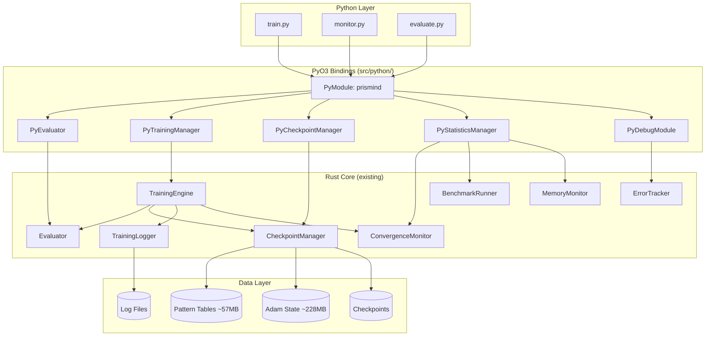
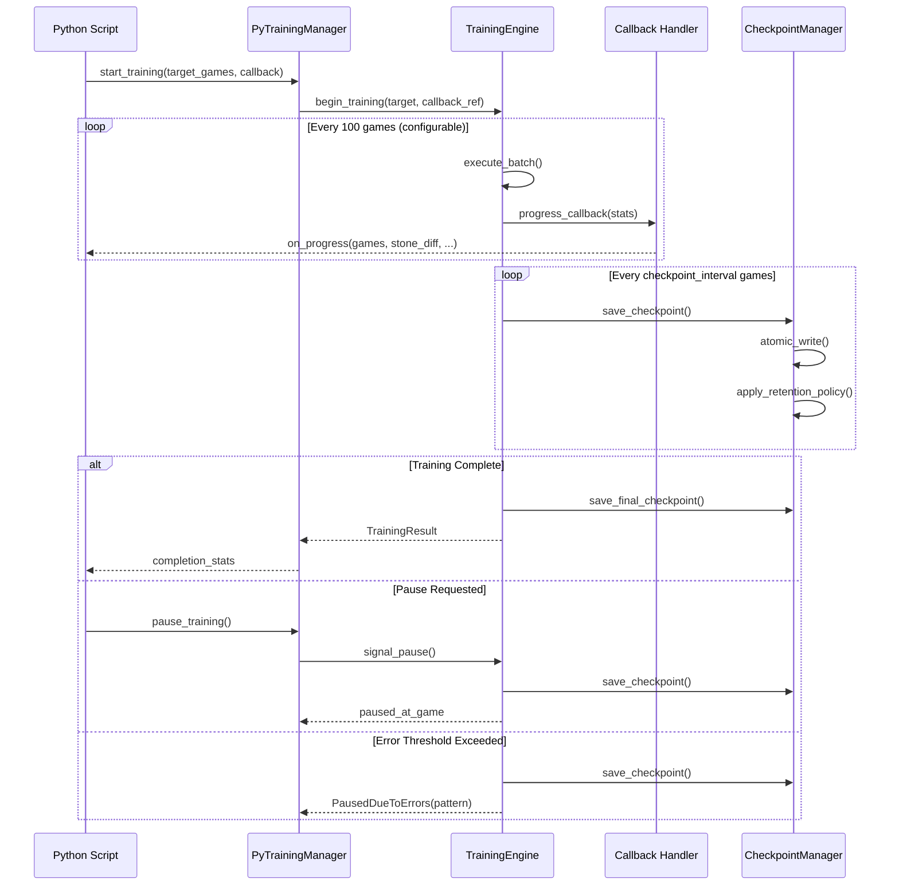
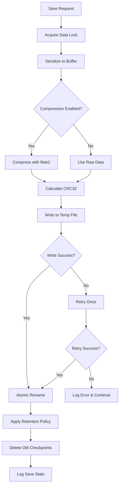
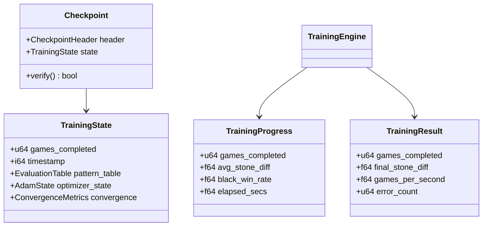

# Design Document: Phase 4 Integration

## Overview

**Purpose**: This feature delivers Python bindings and production-ready training infrastructure to prepare the Prismind Othello AI for 1 million game training execution on OCI Ampere A1. Phase 4 bridges the Rust core (Phase 1-3) with Python training scripts, enabling training operators to orchestrate, monitor, and analyze long-running training sessions.

**Users**: Training operators will utilize this for launching and managing multi-day training runs. Developers will use the debugging utilities for diagnosing issues and validating learning algorithms. Data scientists will leverage the Python API for analysis and visualization.

**Impact**: This phase extends the existing Rust learning module with PyO3 bindings, enhances checkpoint management for production reliability, adds comprehensive logging and monitoring, and provides debugging utilities. Approximately 80% of required internal functionality exists in Phase 1-3; this phase adds the integration layer and production hardening.

### Goals
- Expose complete training API to Python via PyO3 bindings
- Enable pause/resume capability for multi-day training sessions
- Provide robust checkpoint management with atomic saves and retention policies
- Deliver comprehensive logging and convergence monitoring
- Meet 4.6 games/second throughput target on ARM64

### Non-Goals
- GUI development (command-line and script-based interface only)
- Distributed training across multiple machines
- Cloud-specific integrations beyond OCI Ampere A1
- Neural network or deep learning integration (pattern-based evaluation only)

## Architecture

### Existing Architecture Analysis

The Phase 1-3 codebase provides a solid foundation:

| Component | Status | Gap Analysis |
|-----------|--------|--------------|
| CheckpointManager | 90% complete | Needs retention policy, CRC32 checksum, optional compression |
| TrainingLogger | 85% complete | Needs JSON output format, configurable log levels |
| ConvergenceMonitor | 95% complete | Needs PyO3 wrapper only |
| BenchmarkRunner | 95% complete | Needs PyO3 wrapper only |
| MemoryMonitor | 90% complete | Needs PyO3 wrapper only |
| ErrorTracker | 95% complete | Needs watchdog for hung threads |
| TrainingEngine | 70% complete | Needs callback mechanism, pause/resume, progress notifications |

Key files to extend:
- `src/learning/checkpoint.rs` - CheckpointManager
- `src/learning/logger.rs` - TrainingLogger
- `src/learning/training_engine.rs` - TrainingEngine

### Architecture Pattern & Boundary Map



**Architecture Integration**:
- Selected pattern: Wrapper facade with thin PyO3 layer over existing Rust components
- Domain boundaries: Python layer handles orchestration; Rust core handles computation
- Existing patterns preserved: TD learning, pattern evaluation, parallel game execution
- New components rationale: PyO3 wrappers needed for Python interop; new `src/python/` module isolates binding code
- Steering compliance: Maintains 600 MB memory budget, ARM64 optimization focus

### Technology Stack

| Layer | Choice / Version | Role in Feature | Notes |
|-------|------------------|-----------------|-------|
| Python Bindings | PyO3 0.27.1+ | Rust-Python FFI | Requires Rust 1.74+ |
| Build System | maturin 1.8+ | Python wheel building | Supports ARM64 cross-compilation |
| Serialization | bincode + flate2 | Checkpoint format | Optional compression |
| Integrity | crc32fast | Checksum verification | Fast CRC32C implementation |
| Logging | tracing + tracing-subscriber | Structured logging | JSON output support |
| NumPy | numpy (PyO3 integration) | Board array interchange | Uses `numpy` feature flag |

## System Flows

### Training Session Flow



**Flow Decisions**:
- Progress callbacks use GIL release pattern to avoid blocking Python
- Checkpoint saves are atomic (write-to-temp-then-rename)
- Pause operation completes within 5 seconds by finishing current game batch

### Checkpoint Save Flow



## Requirements Traceability

| Requirement | Summary | Components | Interfaces | Flows |
|-------------|---------|------------|------------|-------|
| 1.1-1.10 | PyO3 bindings for training control | PyEvaluator, PyModule | evaluate(), train_game(), train_batch() | Training Flow |
| 2.1-2.7 | Training session management | PyTrainingManager | start_training(), pause_training(), resume_training() | Training Session Flow |
| 3.1-3.10 | Enhanced checkpoint mechanism | PyCheckpointManager, CheckpointManager | save(), load(), set_retention() | Checkpoint Save Flow |
| 4.1-4.8 | Training statistics and logging | TrainingLogger, PyStatisticsManager | log_stats(), get_statistics() | - |
| 5.1-5.8 | Convergence monitoring | ConvergenceMonitor, PyStatisticsManager | get_convergence_metrics() | - |
| 6.1-6.8 | Performance benchmarking | BenchmarkRunner, PyStatisticsManager | run_benchmarks() | - |
| 7.1-7.8 | Memory optimization | MemoryMonitor | get_memory_report() | - |
| 8.1-8.8 | Debugging utilities | PyDebugModule | visualize_board(), inspect_weights() | - |
| 9.1-9.8 | Error handling and recovery | ErrorTracker, TrainingEngine | error thresholds, watchdog | Training Session Flow |
| 10.1-10.8 | Python training scripts | train.py, monitor.py, evaluate.py | CLI arguments | - |
| 11.1-11.8 | Build and deployment | Cargo.toml, pyproject.toml | maturin build | - |
| 12.1-12.8 | Integration testing | tests/integration/ | pytest | - |

## Components and Interfaces

| Component | Domain/Layer | Intent | Req Coverage | Key Dependencies | Contracts |
|-----------|--------------|--------|--------------|------------------|-----------|
| PyModule (prismind) | PyO3 | Python module entry point | 1.1-1.10, 11.1-11.2 | PyO3 (P0) | Service |
| PyEvaluator | PyO3 | Board evaluation wrapper | 1.1-1.2, 1.9-1.10 | Evaluator (P0), NumPy (P1) | Service |
| PyTrainingManager | PyO3 | Training session control | 2.1-2.7, 9.1-9.8 | TrainingEngine (P0), CheckpointManager (P0) | Service, State |
| PyCheckpointManager | PyO3 | Checkpoint operations | 3.1-3.10 | CheckpointManager (P0) | Service |
| PyStatisticsManager | PyO3 | Statistics and monitoring | 4.1-4.8, 5.1-5.8, 6.1-6.8, 7.1-7.8 | ConvergenceMonitor (P0), BenchmarkRunner (P1), MemoryMonitor (P1) | Service |
| PyDebugModule | PyO3 | Debugging utilities | 8.1-8.8 | EvaluationTable (P0), ErrorTracker (P1) | Service |
| CheckpointManager (enhanced) | Core | Atomic save with retention | 3.1-3.10 | bincode (P0), flate2 (P1), crc32fast (P0) | Service |
| TrainingLogger (enhanced) | Core | Structured logging | 4.1-4.8 | tracing (P0) | Service |
| TrainingEngine (enhanced) | Core | Training orchestration | 2.1-2.7, 9.1-9.8 | All learning components (P0) | Service, State |

### PyO3 Bindings Layer (src/python/)

#### PyModule (prismind)

| Field | Detail |
|-------|--------|
| Intent | Python module entry point exposing all PyO3 classes |
| Requirements | 1.1-1.10, 11.1-11.2 |

**Responsibilities & Constraints**
- Register all PyO3 classes with Python interpreter
- Configure module metadata (version, docstrings)
- Handle module initialization errors gracefully

**Dependencies**
- Outbound: PyEvaluator, PyTrainingManager, PyCheckpointManager, PyStatisticsManager, PyDebugModule (P0)

**Contracts**: Service [x]

##### Service Interface
```rust
#[pymodule]
fn prismind(m: &Bound<'_, PyModule>) -> PyResult<()> {
    m.add_class::<PyEvaluator>()?;
    m.add_class::<PyTrainingManager>()?;
    m.add_class::<PyCheckpointManager>()?;
    m.add_class::<PyStatisticsManager>()?;
    m.add_class::<PyDebugModule>()?;
    m.add("__version__", env!("CARGO_PKG_VERSION"))?;
    Ok(())
}
```

#### PyEvaluator

| Field | Detail |
|-------|--------|
| Intent | Wrap Rust Evaluator for Python board evaluation |
| Requirements | 1.1, 1.2, 1.9, 1.10 |

**Responsibilities & Constraints**
- Accept 64-element board arrays (Python list or NumPy array)
- Return evaluation scores as Python floats
- Expose pattern weights for external analysis
- Thread-safe for concurrent evaluation calls

**Dependencies**
- Inbound: Python scripts (P0)
- Outbound: Evaluator (P0), EvaluationTable (P0)
- External: numpy (P1)

**Contracts**: Service [x]

##### Service Interface
```rust
#[pyclass]
pub struct PyEvaluator {
    evaluator: Arc<Evaluator>,
    table: Arc<RwLock<EvaluationTable>>,
}

#[pymethods]
impl PyEvaluator {
    /// Create evaluator with optional checkpoint path
    #[new]
    #[pyo3(signature = (checkpoint_path=None))]
    fn new(checkpoint_path: Option<&str>) -> PyResult<Self>;

    /// Evaluate board position
    /// Args:
    ///     board: 64-element array (0=empty, 1=black, 2=white)
    ///     player: Current player (1=black, 2=white)
    /// Returns:
    ///     Evaluation score as float (positive favors black)
    fn evaluate(&self, board: Vec<i8>, player: i8) -> PyResult<f64>;

    /// Evaluate board from NumPy array
    fn evaluate_numpy<'py>(&self, py: Python<'py>, board: &Bound<'py, PyArray1<i8>>, player: i8) -> PyResult<f64>;

    /// Get pattern weights for analysis
    /// Returns:
    ///     Dict mapping (pattern_id, stage, index) to weight value
    fn get_weights(&self) -> PyResult<HashMap<(usize, usize, usize), f64>>;

    /// Get weight for specific pattern entry
    fn get_weight(&self, pattern_id: usize, stage: usize, index: usize) -> PyResult<f64>;
}
```
- Preconditions: Board array must have exactly 64 elements with values in {0, 1, 2}
- Postconditions: Returns valid float evaluation
- Invariants: Evaluator state is read-only through this interface

#### PyTrainingManager

| Field | Detail |
|-------|--------|
| Intent | Control training session lifecycle with pause/resume |
| Requirements | 2.1-2.7, 9.1-9.8 |

**Responsibilities & Constraints**
- Manage training state machine (idle, training, paused)
- Handle progress callbacks to Python with GIL release
- Coordinate checkpoint saves on pause/completion
- Implement graceful shutdown on interrupt signals
- Track error rates and pause if threshold exceeded

**Dependencies**
- Inbound: Python scripts (P0)
- Outbound: TrainingEngine (P0), CheckpointManager (P0), ErrorTracker (P0)

**Contracts**: Service [x] / State [x]

##### Service Interface
```rust
#[pyclass]
pub struct PyTrainingManager {
    engine: Arc<Mutex<TrainingEngine>>,
    checkpoint_manager: Arc<CheckpointManager>,
    error_tracker: Arc<Mutex<ErrorTracker>>,
    state: Arc<AtomicU8>,  // 0=idle, 1=training, 2=paused
    callback: Option<PyObject>,
}

#[pymethods]
impl PyTrainingManager {
    #[new]
    fn new() -> PyResult<Self>;

    /// Start training toward target game count
    /// Args:
    ///     target_games: Total games to train
    ///     checkpoint_interval: Games between checkpoints (default: 10000)
    ///     callback_interval: Games between progress callbacks (default: 100)
    ///     search_time_ms: Search time per move in milliseconds
    ///     epsilon: Exploration rate (0.0-1.0)
    /// Returns:
    ///     TrainingResult on completion
    #[pyo3(signature = (target_games, checkpoint_interval=10000, callback_interval=100, search_time_ms=15, epsilon=0.1))]
    fn start_training(
        &mut self,
        py: Python<'_>,
        target_games: u64,
        checkpoint_interval: u64,
        callback_interval: u64,
        search_time_ms: u64,
        epsilon: f64,
    ) -> PyResult<PyTrainingResult>;

    /// Pause training and save checkpoint (completes within 5 seconds)
    fn pause_training(&mut self, py: Python<'_>) -> PyResult<u64>;

    /// Resume training from latest checkpoint
    fn resume_training(&mut self, py: Python<'_>) -> PyResult<()>;

    /// Check if training is currently active
    fn is_training_active(&self) -> bool;

    /// Get current training state ("idle", "training", "paused")
    fn get_state(&self) -> String;

    /// Set progress callback function
    /// Callback signature: fn(games: int, stone_diff: float, win_rate: float, elapsed_secs: float)
    fn set_progress_callback(&mut self, callback: PyObject);

    /// Configure training parameters at runtime
    fn configure(&mut self, search_time_ms: Option<u64>, epsilon: Option<f64>, log_level: Option<&str>) -> PyResult<()>;
}

#[pyclass]
pub struct PyTrainingResult {
    #[pyo3(get)]
    pub games_completed: u64,
    #[pyo3(get)]
    pub final_stone_diff: f64,
    #[pyo3(get)]
    pub black_win_rate: f64,
    #[pyo3(get)]
    pub white_win_rate: f64,
    #[pyo3(get)]
    pub draw_rate: f64,
    #[pyo3(get)]
    pub total_elapsed_secs: f64,
    #[pyo3(get)]
    pub games_per_second: f64,
    #[pyo3(get)]
    pub error_count: u64,
}
```

##### State Management
- State model: Finite state machine with states {Idle, Training, Paused}
- Persistence: State persisted in checkpoint metadata
- Concurrency: AtomicU8 for state, Mutex for engine access

**Implementation Notes**
- Progress callbacks release GIL using `py.allow_threads()` during Rust computation
- Pause operation sets atomic flag checked after each game batch
- Watchdog thread monitors worker health and restarts hung threads

#### PyCheckpointManager

| Field | Detail |
|-------|--------|
| Intent | Expose checkpoint save/load with enhanced features |
| Requirements | 3.1-3.10 |

**Responsibilities & Constraints**
- Atomic checkpoint saves (write-to-temp-then-rename)
- Configurable retention policy (keep last N)
- CRC32 integrity verification
- Optional compression (flate2)
- Version validation on load

**Dependencies**
- Inbound: PyTrainingManager (P0), Python scripts (P1)
- Outbound: CheckpointManager (P0)
- External: bincode (P0), flate2 (P1), crc32fast (P0)

**Contracts**: Service [x]

##### Service Interface
```rust
#[pyclass]
pub struct PyCheckpointManager {
    inner: Arc<CheckpointManager>,
}

#[pymethods]
impl PyCheckpointManager {
    #[new]
    #[pyo3(signature = (checkpoint_dir="checkpoints", retention_count=5, compression_enabled=false))]
    fn new(checkpoint_dir: &str, retention_count: usize, compression_enabled: bool) -> PyResult<Self>;

    /// Save checkpoint with current training state
    /// Returns:
    ///     Tuple of (checkpoint_path, file_size_bytes, save_duration_secs)
    fn save(&self, py: Python<'_>, training_state: &PyTrainingManager) -> PyResult<(String, u64, f64)>;

    /// Load checkpoint from path
    /// Returns:
    ///     TrainingState dictionary
    fn load(&self, py: Python<'_>, checkpoint_path: &str) -> PyResult<PyObject>;

    /// Load latest checkpoint in directory
    fn load_latest(&self, py: Python<'_>) -> PyResult<Option<PyObject>>;

    /// List available checkpoints with metadata
    /// Returns:
    ///     List of (path, games_completed, timestamp, size_bytes)
    fn list_checkpoints(&self) -> PyResult<Vec<(String, u64, String, u64)>>;

    /// Set retention policy
    fn set_retention(&mut self, count: usize);

    /// Enable/disable compression
    fn set_compression(&mut self, enabled: bool);

    /// Verify checkpoint integrity
    fn verify(&self, checkpoint_path: &str) -> PyResult<bool>;
}
```
- Preconditions: Checkpoint directory must be writable
- Postconditions: Save operation either succeeds completely or leaves no partial file
- Invariants: Checkpoint count never exceeds retention limit after save

#### PyStatisticsManager

| Field | Detail |
|-------|--------|
| Intent | Unified statistics and monitoring access |
| Requirements | 4.1-4.8, 5.1-5.8, 6.1-6.8, 7.1-7.8 |

**Responsibilities & Constraints**
- Aggregate metrics from ConvergenceMonitor, BenchmarkRunner, MemoryMonitor
- Provide Python-accessible metric dictionaries
- Support JSON export for external tools

**Dependencies**
- Inbound: Python scripts (P0)
- Outbound: ConvergenceMonitor (P0), BenchmarkRunner (P1), MemoryMonitor (P1), TrainingLogger (P0)

**Contracts**: Service [x]

##### Service Interface
```rust
#[pyclass]
pub struct PyStatisticsManager {
    convergence: Arc<Mutex<ConvergenceMonitor>>,
    benchmark: Arc<BenchmarkRunner>,
    memory: Arc<MemoryMonitor>,
    logger: Arc<TrainingLogger>,
}

#[pymethods]
impl PyStatisticsManager {
    /// Get current training statistics
    fn get_statistics(&self) -> PyResult<PyObject>;

    /// Get convergence metrics
    /// Returns:
    ///     Dict with stone_diff_avg, eval_variance, pattern_coverage, stagnation_detected
    fn get_convergence_metrics(&self) -> PyResult<PyObject>;

    /// Get memory usage breakdown
    /// Returns:
    ///     Dict with total_mb, pattern_tables_mb, adam_state_mb, tt_mb, misc_mb
    fn get_memory_report(&self) -> PyResult<PyObject>;

    /// Run performance benchmarks
    /// Returns:
    ///     Dict with games_per_sec, td_update_ms, checkpoint_save_secs, cpu_utilization
    fn run_benchmarks(&self, iterations: u64) -> PyResult<PyObject>;

    /// Export statistics to JSON file
    fn export_json(&self, path: &str) -> PyResult<()>;

    /// Get estimated time remaining
    fn get_eta(&self, target_games: u64, current_games: u64) -> PyResult<f64>;
}
```

#### PyDebugModule

| Field | Detail |
|-------|--------|
| Intent | Debugging and diagnostic utilities |
| Requirements | 8.1-8.8 |

**Responsibilities & Constraints**
- Board and pattern visualization
- Weight inspection and comparison
- Game replay with detailed logging
- Anomaly detection and reporting

**Dependencies**
- Inbound: Python scripts (P1)
- Outbound: EvaluationTable (P0), ErrorTracker (P1)

**Contracts**: Service [x]

##### Service Interface
```rust
#[pyclass]
pub struct PyDebugModule {
    table: Arc<RwLock<EvaluationTable>>,
    error_tracker: Arc<Mutex<ErrorTracker>>,
}

#[pymethods]
impl PyDebugModule {
    /// Visualize board as ASCII string
    fn visualize_board(&self, board: Vec<i8>) -> String;

    /// Visualize pattern weights for a position
    fn visualize_pattern(&self, board: Vec<i8>, pattern_id: usize) -> String;

    /// Inspect eligibility trace values
    fn inspect_trace(&self, board: Vec<i8>) -> PyResult<PyObject>;

    /// Compare two checkpoints and report differences
    fn compare_checkpoints(&self, path1: &str, path2: &str) -> PyResult<PyObject>;

    /// Replay a game with detailed logging
    fn replay_game(&self, game_history: Vec<PyObject>, verbose: bool) -> PyResult<Vec<String>>;

    /// Export training data to CSV
    fn export_csv(&self, path: &str, data_type: &str) -> PyResult<()>;

    /// Get recent error summary
    fn get_error_summary(&self) -> PyResult<PyObject>;

    /// Detect anomalous weight values
    fn detect_anomalies(&self, threshold: f64) -> PyResult<Vec<(usize, usize, usize, f64)>>;
}
```

### Core Layer Enhancements

#### CheckpointManager (enhanced)

| Field | Detail |
|-------|--------|
| Intent | Production-grade checkpoint save/load with integrity |
| Requirements | 3.1-3.10 |

**Responsibilities & Constraints**
- Atomic write using temp file and rename
- CRC32 checksum calculation and verification
- Optional flate2 compression
- Retention policy enforcement
- Version header for compatibility

**Dependencies**
- Outbound: EvaluationTable (P0), AdamOptimizer (P0)
- External: bincode (P0), flate2 (P1), crc32fast (P0)

**Contracts**: Service [x]

##### Service Interface
```rust
pub struct CheckpointManager {
    checkpoint_dir: PathBuf,
    retention_count: usize,
    compression_enabled: bool,
}

impl CheckpointManager {
    /// Create with configuration
    pub fn new(checkpoint_dir: impl AsRef<Path>, retention_count: usize, compression_enabled: bool) -> Self;

    /// Save checkpoint atomically
    /// Returns: (path, size_bytes, duration)
    pub fn save(&self, state: &TrainingState) -> Result<(PathBuf, u64, Duration), LearningError>;

    /// Load checkpoint with integrity verification
    pub fn load(&self, path: impl AsRef<Path>) -> Result<TrainingState, LearningError>;

    /// Load latest checkpoint in directory
    pub fn load_latest(&self) -> Result<Option<TrainingState>, LearningError>;

    /// Apply retention policy (delete old checkpoints)
    pub fn apply_retention(&self) -> Result<Vec<PathBuf>, LearningError>;

    /// Verify checkpoint integrity without loading
    pub fn verify(&self, path: impl AsRef<Path>) -> Result<bool, LearningError>;
}

/// Checkpoint file format
pub struct CheckpointHeader {
    pub magic: [u8; 4],           // "PRSM"
    pub version: u32,             // Format version
    pub flags: u32,               // Compression, etc.
    pub checksum: u32,            // CRC32 of data
    pub games_completed: u64,
    pub timestamp: i64,
}
```

#### TrainingLogger (enhanced)

| Field | Detail |
|-------|--------|
| Intent | Structured logging with JSON support |
| Requirements | 4.1-4.8 |

**Responsibilities & Constraints**
- Real-time statistics output every 100 games
- Detailed statistics every 10,000 games
- Configurable log levels
- JSON format output option
- Timestamped log files

**Dependencies**
- External: tracing (P0), tracing-subscriber (P0)

**Contracts**: Service [x]

##### Service Interface
```rust
pub struct TrainingLogger {
    log_dir: PathBuf,
    log_level: LogLevel,
    json_output: bool,
}

pub enum LogLevel {
    Debug,
    Info,
    Warning,
    Error,
}

impl TrainingLogger {
    pub fn new(log_dir: impl AsRef<Path>, level: LogLevel, json_output: bool) -> Self;

    /// Log real-time statistics (every 100 games)
    pub fn log_stats(&self, stats: &TrainingStats);

    /// Log detailed statistics (every 10,000 games)
    pub fn log_detailed(&self, stats: &DetailedStats);

    /// Log checkpoint summary
    pub fn log_checkpoint(&self, path: &Path, stats: &TrainingStats);

    /// Log warning for divergent values
    pub fn log_divergence_warning(&self, pattern_id: usize, stage: usize, index: usize, value: f64);

    /// Log estimated time remaining
    pub fn log_eta(&self, remaining_games: u64, games_per_sec: f64);
}
```

#### TrainingEngine (enhanced)

| Field | Detail |
|-------|--------|
| Intent | Training orchestration with pause/resume and callbacks |
| Requirements | 2.1-2.7, 9.1-9.8 |

**Responsibilities & Constraints**
- Execute self-play games with rayon parallelism
- Support pause/resume via atomic flag
- Invoke progress callbacks at configurable intervals
- Track error rates and pause if threshold exceeded
- Implement watchdog for hung worker threads

**Dependencies**
- Outbound: Evaluator (P0), CheckpointManager (P0), ConvergenceMonitor (P0), ErrorTracker (P0)
- External: rayon (P0), crossbeam-channel (P1)

**Contracts**: Service [x] / State [x]

##### Service Interface
```rust
pub struct TrainingEngine {
    evaluator: Arc<Evaluator>,
    table: Arc<RwLock<EvaluationTable>>,
    adam: Arc<Mutex<AdamOptimizer>>,
    convergence: Arc<Mutex<ConvergenceMonitor>>,
    error_tracker: Arc<Mutex<ErrorTracker>>,
    games_completed: AtomicU64,
    pause_flag: AtomicBool,
    callback_tx: Option<Sender<TrainingProgress>>,
}

impl TrainingEngine {
    pub fn new(evaluator: Arc<Evaluator>, table: Arc<RwLock<EvaluationTable>>, adam: Arc<Mutex<AdamOptimizer>>) -> Self;

    /// Execute training toward target with callbacks
    pub fn train(
        &mut self,
        target_games: u64,
        config: TrainingConfig,
        progress_callback: Option<Box<dyn Fn(TrainingProgress) + Send>>,
    ) -> Result<TrainingResult, LearningError>;

    /// Signal pause (returns after current batch completes)
    pub fn signal_pause(&self);

    /// Check if paused
    pub fn is_paused(&self) -> bool;

    /// Get current game count
    pub fn games_completed(&self) -> u64;

    /// Set callback channel for progress updates
    pub fn set_callback_channel(&mut self, tx: Sender<TrainingProgress>);
}

pub struct TrainingConfig {
    pub search_time_ms: u64,
    pub epsilon: f64,
    pub checkpoint_interval: u64,
    pub callback_interval: u64,
    pub num_threads: usize,
}

pub struct TrainingProgress {
    pub games_completed: u64,
    pub avg_stone_diff: f64,
    pub black_win_rate: f64,
    pub elapsed_secs: f64,
}
```

##### State Management
- State model: games_completed (AtomicU64), pause_flag (AtomicBool)
- Persistence: State saved with checkpoint
- Concurrency: Lock-free atomics for hot path, Mutex for infrequent updates

## Data Models

### Domain Model



### Physical Data Model

#### Checkpoint File Format

```
+----------------------+
| CheckpointHeader     |  28 bytes
|   magic: [u8; 4]     |  "PRSM"
|   version: u32       |  1
|   flags: u32         |  bit 0: compressed
|   checksum: u32      |  CRC32 of data
|   games_completed: u64|
|   timestamp: i64     |
+----------------------+
| Data Payload         |  ~285 MB (uncompressed)
|   pattern_tables     |  ~57 MB
|   adam_m_moments     |  ~114 MB
|   adam_v_moments     |  ~114 MB
|   adam_t: u64        |
|   convergence_state  |  ~1 KB
+----------------------+
```

#### Log File Format

JSON format (when enabled):
```json
{
  "timestamp": "2025-11-29T12:00:00Z",
  "level": "info",
  "event": "training_stats",
  "games": 1000,
  "stone_diff_avg": 5.2,
  "black_win_rate": 0.52,
  "white_win_rate": 0.48,
  "draw_rate": 0.0,
  "elapsed_secs": 217.5,
  "games_per_sec": 4.6
}
```

## Error Handling

### Error Strategy

| Error Type | Response | Recovery |
|------------|----------|----------|
| Search Error | Log and skip game | Continue to next game (Req 9.1) |
| Checkpoint Save Failure | Retry once after 5s | Log warning, continue training (Req 9.2) |
| NaN/Inf Evaluation | Reset to neutral (32768) | Log warning, continue (Req 9.3) |
| Worker Thread Panic | Catch and log | Restart worker (Req 9.4) |
| Error Rate > 1% | Save checkpoint, pause | Report error pattern (Req 9.5-9.6) |
| Checkpoint Load Failure | Offer options | Start fresh or try previous (Req 9.7) |
| Hung Worker Thread | Watchdog detection | Restart thread (Req 9.8) |

### Error Categories and Responses

**Training Errors**: Invalid config -> validation error; Resource exhaustion -> memory warning
**IO Errors**: Checkpoint write failure -> retry once; Log write failure -> fallback to stderr
**Integrity Errors**: Checksum mismatch -> corruption error; Version mismatch -> incompatibility error

### Monitoring

- Error counts tracked per 10,000 game window
- Error patterns reported in summary
- Anomalous weight changes logged with position details

## Testing Strategy

### Unit Tests
- PyEvaluator: Board array conversion, evaluation accuracy
- PyCheckpointManager: Atomic save, CRC32 verification, retention policy
- TrainingEngine: Pause/resume state transitions
- ErrorTracker: Window-based error rate calculation

### Integration Tests
- Python-to-Rust round-trip for all PyO3 methods (Req 12.1)
- Checkpoint save/load preserves state exactly (Req 12.2)
- Parallel training without data races (Req 12.3)
- Memory stays within 600 MB budget (Req 12.4)
- Graceful shutdown saves checkpoint (Req 12.5)
- Convergence metrics over 1,000 game sample (Req 12.6)
- Performance benchmarks meet thresholds (Req 12.7)

### Performance Tests
- Game throughput >= 4.6 games/second (Req 6.1)
- TD update latency < 10ms (Req 6.2)
- Checkpoint save < 30 seconds (Req 6.3)
- CPU utilization >= 80% (Req 6.6)

## Performance & Scalability

### Target Metrics

| Metric | Target | Measurement |
|--------|--------|-------------|
| Game Throughput | >= 4.6 games/sec | BenchmarkRunner |
| TD Update Latency | < 10ms | BenchmarkRunner |
| Checkpoint Save | < 30 seconds | Checkpoint timing |
| Memory Usage | <= 600 MB | MemoryMonitor |
| CPU Utilization | >= 80% | System metrics |
| Total Training Time | 50-60 hours for 1M games | Time estimation |

### ARM64 Optimizations

- Enable NEON SIMD via target-cpu=native
- LTO (Link-Time Optimization) for cross-crate inlining
- codegen-units=1 for maximum optimization
- Profile-guided optimization (optional)

## Build Configuration

### Cargo.toml Additions
```toml
[lib]
name = "prismind"
crate-type = ["cdylib", "rlib"]

[dependencies]
pyo3 = { version = "0.27", features = ["extension-module", "abi3-py38"] }
numpy = "0.27"
crc32fast = "1.4"
flate2 = "1.0"

[profile.release]
opt-level = 3
lto = true
codegen-units = 1
```

### pyproject.toml
```toml
[build-system]
requires = ["maturin>=1.8,<2.0"]
build-backend = "maturin"

[project]
name = "prismind"
requires-python = ">=3.8"
classifiers = [
    "Programming Language :: Rust",
    "Programming Language :: Python :: Implementation :: CPython",
]

[tool.maturin]
features = ["pyo3/extension-module"]
python-source = "python"
module-name = "prismind._prismind"
```

### ARM64 Cross-Compilation

```bash
# Using maturin with zig for cross-compilation
maturin build --release --target aarch64-unknown-linux-gnu --zig

# Or using Docker
docker run --rm -v "$(pwd)":/io -w /io \
  ghcr.io/pyo3/maturin:latest \
  build --release --target aarch64-unknown-linux-gnu
```

## Supporting References

### Research Sources
- [PyO3 User Guide](https://pyo3.rs/) - PyO3 0.27.1 documentation
- [Maturin User Guide](https://www.maturin.rs/) - Build and publish crates with PyO3
- [PyO3 GitHub Discussions](https://github.com/PyO3/pyo3/discussions/3659) - Python callback patterns
- [Maturin ARM64 Cross-Compilation](https://www.maturin.rs/distribution.html) - Distribution guide

### Internal References
- `src/learning/checkpoint.rs` - Existing CheckpointManager implementation
- `src/learning/logger.rs` - Existing TrainingLogger implementation
- `src/learning/convergence.rs` - ConvergenceMonitor implementation
- `src/learning/benchmark.rs` - BenchmarkRunner implementation
- `src/learning/memory.rs` - MemoryMonitor implementation
- `src/learning/error_handler.rs` - ErrorTracker implementation
